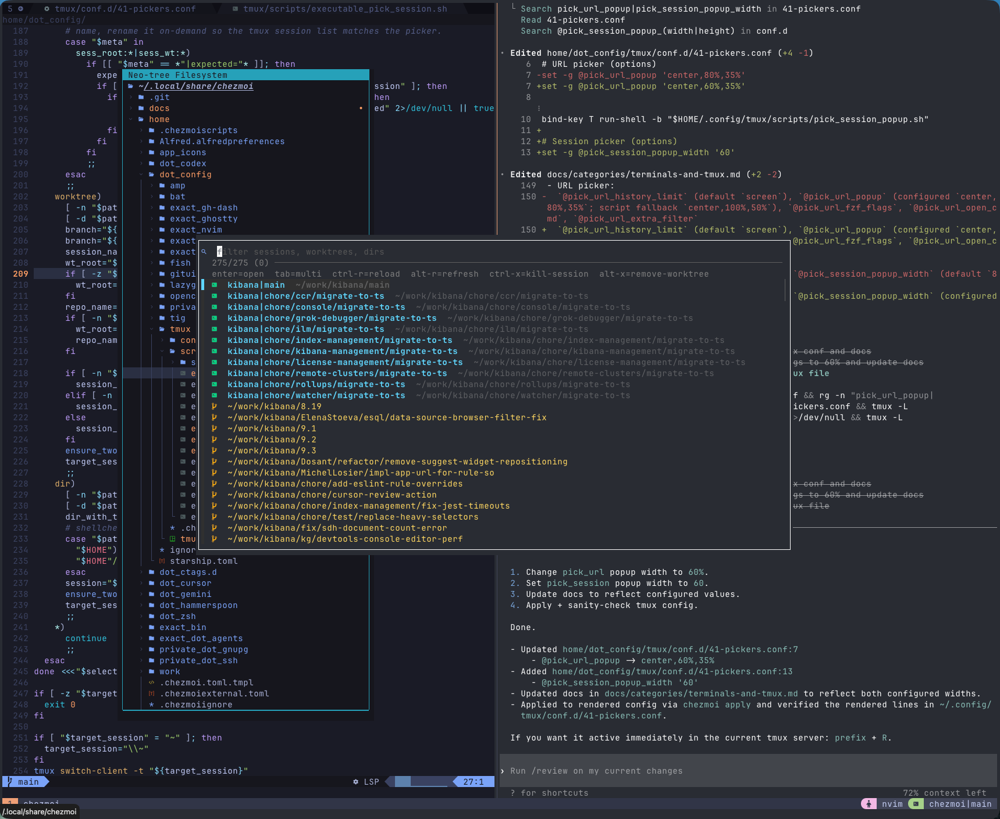

# 🚀 kapral18/dotfiles: An Operator's Manual

This is not your regular collection of settings; it's a cohesive, highly-opinionated,
and continuously evolving development ecosystem, meticulously crafted for macOS.
It's a testament to the power of a keyboard-centric workflow, intelligent automation,
and deep tool integration.

## 🛠️ Installation

1.  **Install 1Password:** The entire setup hinges on the 1Password CLI and
    its SSH agent for managing secrets and identities.
2.  **Initialize Chezmoi:** This single command will bootstrap the entire
    environment.

        ```bash sh -c "$(curl -fsLS get.chezmoi.io/lb)" -- init --apply kapral18
        ```

---

## 🏛️ Chezmoi & ASDF

This setup's power comes from the deep integration between Chezmoi for
management and ASDF for runtime versioning.

### Chezmoi: The Conductor

Chezmoi is more than a dotfile symlinker; it's the brain of the operation,
using templates and scripts to build a configuration tailored to the specific
machine.

- **Conditional Logic (`.isWork`)**: Many files are templates (`*.tmpl`). They
  use a `{{ .isWork }}` variable to conditionally include or exclude
  configurations. This is how the setup seamlessly manages different Git
  identities, SSH keys, and even installed ASDF plugins for personal vs. work
  machines.
- **External Tools & Scripts**: Chezmoi manages a `~/bin` directory of custom
  scripts. The `executable_` prefix in a filename tells Chezmoi to set the
  executable bit, making these scripts instantly available in the `PATH`.
- **Automated Setup Scripts**: The `f-apply-app-icons` script is a perfect
  example. It's a shell script template that uses `yq` to parse a YAML
  definition (`app_icons/icon_mapping.yaml`) and the `fileicon` utility to apply
  beautiful custom icons to applications in `/Applications`. This entire
  customization is applied automatically with `chezmoi apply`.

### ASDF: The Universal Version Manager

ASDF is used to manage versions of nearly every tool and language, ensuring
reproducible environments.

- **Declarative Plugin Management (`asdf_plugins.tmpl`)**: The list of ASDF
  plugins is not static; it's a Chezmoi template. This allows for conditionally
  installing plugins (like `lua`) only in a personal environment.
- **Declarative Versioning (`.tool-versions.tmpl`)**: The `.tool-versions`
  file, the source of truth for what version of a tool to use, is also a
  template. This allows for different tool versions between environments if
  needed.
- **Automatic Version Switching**: The shell configuration files
  (`config.fish`, `.zshrc`, etc.) are set up to initialize ASDF. Thanks to
  ASDF's shims and the `.tool-versions` file, simply `cd`-ing into a project
  directory will automatically make the correct versions of Node.js, Ruby, Go,
  etc., available in your shell. No manual switching is ever required.

---

## 🐚 The King of Shells: Fish

The primary shell is **Fish**, but Zsh and Bash are also fully configured for
consistency.

### 🌳 Advanced Git Worktree Management (worktree helpers)

This is the crown jewel of the shell environment, turning Git's powerful but
clunky `worktree` feature into a seamless, everyday tool.

- **`f-wtree add <branch> [base_branch]`**: An incredibly smart function that
  handles numerous scenarios:
  - Creates a worktree from an existing local branch.
  - Creates a worktree from a remote branch on `origin` or `upstream`.
  - Handles branches from forks (e.g., `f-wtree add
some-user/feature-branch`).
  - Creates a new branch from `HEAD` if the branch doesn't exist anywhere.
  - Organizes worktrees by creating nested directories for branches with
    slashes (e.g., `feature/new-ui`).

- **`f-wtree prs <pr_numbers_or_search>`**: A massive time-saver. Type a PR
  number or search term, and it will:
  1. Use `fzf` to let you select the exact PR with a rich preview.
  2. Fetch PR details from the GitHub API.
  3. Add the contributor's fork as a temporary remote.
  4. Create a worktree for the PR's branch.

- **`f-wtree remove`**: An `fzf`-powered interactive worktrees remover that:
  1. Removes each selected worktree directory.
  2. Deletes the associated local branch.
  3. **Cleans up the remote**: If the worktree was from a fork, it removes
     the temporary remote if no other worktrees are using it.
  4. **Cleans up the filesystem**: Removes any empty parent directories.
  5. Removes the path from `zoxide`'s database.

- **Tmux Integration**: The worktree functions are tightly integrated with
  Tmux. A new, named Tmux session is created when a worktree is added and killed
  when it's removed, making context-switching effortless.

### 🤖 Custom Functions & Utilities

The repository includes an extensive collection of custom scripts and utilities
designed to enhance productivity and automate common development tasks. These
scripts are located in `~/bin` (managed by chezmoi) and provide powerful
functionality:

- **`f-add-patch-to-prs`**: Adds patch files to existing PRs for easy updates
- **`f-wtree`**: Enhanced git worktree management with automatic branch creation and remote handling
- **`f-appid`**: Retrieves application identifiers for macOS apps for automation
- **`f-apply-app-icons`**: Applies custom icons to applications based on YAML mapping definitions
- **`f-bat-preview`**: Uses bat for file preview with syntax highlighting in fuzzy finders
- **`f-check-backport-progress`**: A powerful script for repository maintainers.
  It uses the `gh` CLI to find PRs with specific labels and checks if they have
  been correctly backported to release branches.
- **`f-cp-files-for-llm`**: Recursively finds all text files in a directory,
  concatenates their contents (with file headers), and copies it to the
  clipboard, ready for pasting into an LLM.
- **`f-dumputi`**: Custom utility functions for various development tasks
- **`f-get-risky-tests`**: Identifies potentially flaky or risky tests in test suites
- **`f-gh-subissues-create`**: Creates GitHub sub-issues for detailed task breakdown
- **`f-grepo`**: Enhanced git repository operations and navigation utilities
- **`f-history-sync`**: Synchronizes fish shell history via 1Password for seamless
  history across devices
- **`f-list-prs`**: Lists GitHub PRs with advanced filtering and search capabilities
- **`f-pdf-diff`**: A visual diff tool for PDFs. It uses ImageMagick to render
  two PDFs as images and composites them, highlighting all differences in red.
- **`f-search-brew-desc`**: Interactive search through Homebrew package descriptions
- **`f-search-gh-topic`**: Searches GitHub repositories by topic with fuzzy filtering
- **`f-tmux-lowfi`**: A clever script that controls a `lowfi` music player
  running inside a dedicated, detached tmux session. You can play, pause, and
  skip tracks from any terminal window without interrupting your workflow.
- **`f-to-gif`**: Converts videos to optimized GIFs with quality and size controls
- **`f-vid-ipad`**: Processes videos for iPad optimization and format conversion
- \*\*GitHub PR Management (`f-disable-auto-merge`, `f-enable-auto-merge`):
  Functions to bulk-disable/enable auto-merge on PRs, useful for managing
  release branches.

All scripts are designed with consistent error handling, self-documenting help
text, and follow established naming conventions. Fish shell completions are
provided for all scripts for enhanced usability.

---

## 🔐 Git & 1Password

The Git configuration is a masterclass in efficiency, safety, and identity
management.

### The 1Password SSH Identity Trick (`.gitconfig.tmpl`)

This is a game-changing solution for managing multiple Git identities (e.g.,
personal and work) on the same machine securely and automatically.

> **How it works:**
>
> 1. The global `.gitconfig` sets an `sshCommand` override: `sshCommand = ssh
-o IdentitiesOnly=yes -o IdentityFile="~/.ssh/primary_public_key.pub"`
> 2. Crucially, `IdentityFile` points to the **public key**. 1Password's SSH
>    agent intercepts this and uses the corresponding private key from the
>    vault for signing.
> 3. A conditional include, `[includeIf "gitdir:~/work/"]`, loads a separate
>    `.gitconfig` for work projects.
> 4. The work-specific `.gitconfig` overrides the `sshCommand` again, this
>    time pointing to the **work public key**.
>
> **The result:** Git automatically uses the correct SSH key for signing and
> authentication based on the directory you're in, all without exposing
> private keys on disk or juggling complex `~/.ssh/config` files. It's secure,
> seamless, and fully automated.

### Git Aliases & Smarter Defaults

- **Powerful Aliases**:
  - `git wtgrab <worktree_path>`: "Grabs" uncommitted changes from another
    worktree by creating a diff, resetting the source worktree, and applying the
    diff to your current one.
  - `git squash <n>`: An interactive one-liner to squash the last `n` commits,
    pre-filling the new commit message with the old ones.
  - `git u`: Your daily driver. A single command to fetch, pull with rebase,
    and purge old, merged branches.
  - `git hide`/`unhide <file>`: Uses `update-index --assume-unchanged` to tell
    Git to ignore changes to a tracked file, perfect for local config overrides.
- **Smarter Defaults**:
  - **`rerere` (reuse recorded resolution) is enabled** to make resolving
    repeated merge conflicts automatic.
  - **`rebase.autoSquash = true`** makes `git rebase -i` automatically handle
    `fixup!` and `squash!` commits.
  - **`rebase.updateRefs = true`** makes rebasing stacked branches much safer.
  - The superior `histogram` diff algorithm and `zdiff3` conflict style are
    defaults.
  - **`feature.manyFiles = true`**: Opts into a newer, faster index format for
    repositories with a large number of files.

---

## 💻 Terminals & Multiplexers

### Tmux: The Supercharged Multiplexer (`tmux.conf`)

The Tmux setup is designed for a seamless, keyboard-driven experience that
integrates perfectly with Neovim.

- **Ergonomic Prefix**: The prefix is remapped from `C-b` to the more
  accessible `C-Space`.
- **Plugin-Powered Workflow**:
  - **`tpm`**: The plugin manager itself.
  - **`tmux-resurrect` & `tmux-continuum`**: Your session is automatically
    saved every 15 minutes and restored on startup. Never lose your layout
    again.
  - **`tmux-pain-control`**: Provides easy, repeatable keybindings for
    resizing and swapping panes.
  - **`tmux-sessionist`**: A powerful session manager for quickly switching
    between projects.
  - **`tmux-fzf-url`**: A killer feature. Press a key to scan your entire
    scrollback buffer for URLs and open one in your browser using `fzf`.
  - **`tmux-theme-catppuccin`**: Provides the beautiful, consistent theme.
- **Neovim Passthrough**: Keybindings like `Ctrl-Shift-h/j/k/l` are configured
  to be passed _through_ Tmux directly to the running application, allowing for
  seamless window resizing and navigation inside Neovim without conflicting with
  Tmux's own keys.
- **Vi Mode**: Pane navigation and copy mode use Vi keybindings for
  consistency with Neovim.

---

## 💎 Neovim: The IDE as a Force Multiplier

This is a heavily customized setup, transformed into a bespoke IDE.

### ✨ UI & User Experience

- **The Dynamic Winbar (`options.lua`):** A custom-built marvel that displays
  the truncated path of the current file relative to the project root, ensuring
  you always know where you are without cluttering the bufferline.
- **The Supercharged Tab Key (`tab-behavior.lua`):** A context-aware
  powerhouse that accepts Copilot suggestions, jumps through snippets, and tabs
  out of brackets/quotes.
- **Minimalist Code View:** Long, noisy `className` attributes are concealed
  to a single `…` character.
- **Custom Keymaps (`keymaps.lua`):** `jk` is mapped to `<ESC>`, `<A-j/k>`
  jumps 10 lines, and `<C-A-j/k>` moves lines up and down.

### 🧠 Development & LSP Power-ups

- **Interactive Filtered LSP (`fzf-filters-lsp.lua`):** A killer feature! When
  searching for definitions or references, you get an interactive prompt to
  filter out irrelevant files (tests, `node_modules`) and content (imports). It
  even displays the file's **CODEOWNERS** in the results!
- **Advanced Jest Runner (`run-jest-in-split.lua`):** A complete testing suite
  that can run the specific `describe`/`it` block your cursor is in, handle
  parameterized tests, run in debug mode, and update snapshots.
- **AI-Powered Commits (`summarize-commit.lua`):** Generate a conventional
  commit message from your staged changes using Ollama, Cloudflare AI, or OpenRouter with a
  single keypress.
- **TypeScript Refactoring (`ts-move-exports.lua`):** A custom tool to select
  a block of exported code, move it to a new file, and automatically update all
  import paths across the project.
- **Source/Test Switching (`switch-src-test.lua`):** A smart `<C-^>` mapping
  to instantly jump between a source file and its corresponding test file.

### 🛠️ Project & File Utilities

- **`LargeFiles` Command:** Finds files in your project that exceed a certain
  line count.
- **`CpFromDownloads` Command:** A Neo-tree helper to quickly construct a `cp`
  command from your `~/Downloads` folder.
- **`owner-code-search.lua`**: Custom commands to search _only_ within files
  owned by a specific team, as defined in `CODEOWNERS`.
- **`show-file-owner.lua`**: A quick command to display the owner of the
  current file.

---

## 🖥️ macOS Automation: Hammerspoon & Beyond

- **Hammerspoon for Total Control:**
  - **`gridmouse.lua`**: A complete, Vi-like mouse control system. Activate it
    and use `h/j/k/l` to move the mouse, or enter **Grid Mode** to jump the
    cursor to precise screen locations with just a few keystrokes.
  - **Window Management (`window.lua`):** Simple, fast hotkeys (`Hyper +
h/j/k/l/m`) to snap windows to half/full screen positions.
- **Custom App Icons (`f-apply-app-icons`):** A script that applies beautiful
  custom icons to your applications for a clean, consistent look.
