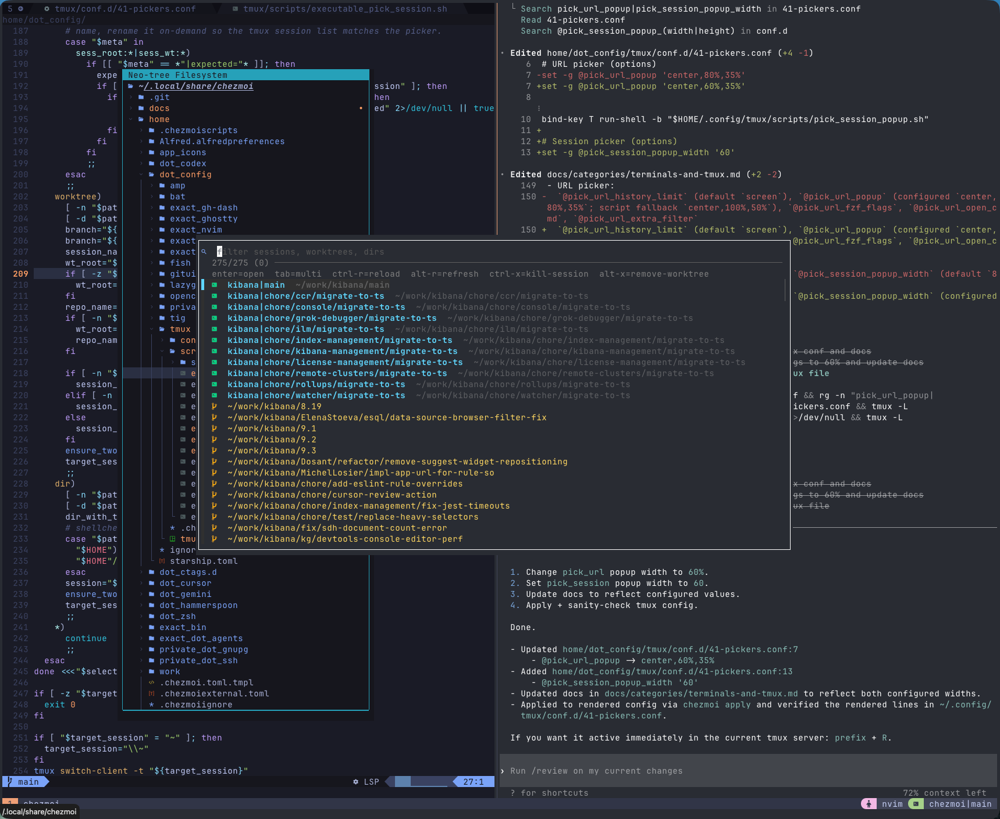

<!-- markdownlint-disable MD041 -->



# 🚀 kapral18/dotfiles

Personal macOS development environment managed with Chezmoi. Keyboard-centric workflow with extensive automation and tool integration.

**Start here:** published docs at <https://kapral18.github.io/dotfiles/> (source: [`docs/intro/index.md`](docs/intro/index.md)). The README is an orientation page; recipes, command catalogs, and subsystem detail live in `docs/`.

## ✨ Key Features

| Feature                | Description                                                    |
| ---------------------- | -------------------------------------------------------------- |
| 🤖 **Agent Memory**    | Beads integration + `/tmp/specs` hook memory (`,agent-memory`) |
| 🔄 **Ralph**           | Multi-agent orchestrator (planner → executor → reviewers)      |
| 🧠 **Local inference** | llama.cpp router + model sync (`,llama-cpp`)                   |
| 🔐 **Secure Identity** | 1Password SSH agent with work/personal switching               |
| 🌳 **Git Worktrees**   | Worktree management with PR integration                        |
| 💎 **Neovim**          | Custom LSP, AI commits, refactoring tools                      |
| 🐚 **Fish Shell**      | 40+ custom productivity commands in `~/bin`                    |
| 📦 **Brewfile**        | 280+ formulas and casks (per-category partials)                |
| ⚙️ **Mise**            | Version manager with automatic switching                       |

## 🛠️ Quick Start

### Prerequisites

1. **1Password** installed and signed in (SSH agent + secrets).

### Bootstrap

```bash
sh -c "$(curl -fsLS get.chezmoi.io/lb)" -- init --apply kapral18
```

Safer first run: preview with `chezmoi init kapral18 && chezmoi diff` before applying. See [Getting Started](docs/intro/getting-started.md) and [New machine bootstrap](docs/intro/new-machine-bootstrap.md) for the full first-run story (prompts, hooks, and what gets installed).

## 🏛️ How It Fits Together

Chezmoi renders templates from [`home/`](home/) into `$HOME`. Hooks in [`home/.chezmoiscripts/`](home/.chezmoiscripts/) install and reconcile packages when lists change. The `.isWork` prompt forks identity, secrets, and some package lists between work and personal machines.

For the full layout (naming conventions, hook lifecycle, AI config merging, externals), see [Architecture](docs/intro/architecture.md).

## 📚 Subsystems (read the docs)

| Area                                     | Doc                                                         | Source-of-truth (edit here)                                                                              |
| ---------------------------------------- | ----------------------------------------------------------- | -------------------------------------------------------------------------------------------------------- |
| Packages (Homebrew, mise, cargo, go, …)  | [Packages](docs/topics/core/packages/index.md)              | [`home/.chezmoitemplates/brews/`](home/.chezmoitemplates/brews/), [`home/readonly_dot_default-*`](home/) |
| Custom `~/bin` commands                  | [Custom commands](docs/topics/workflow/custom-commands.md)  | [`home/exact_bin/`](home/exact_bin/)                                                                     |
| Git identity & worktrees                 | [Worktrees](docs/topics/workflow/git-identity/worktrees.md) | [`home/exact_bin/executable_,w`](home/exact_bin/executable_,w)                                           |
| GitHub picker & tmux                     | [Tmux](docs/topics/workflow/tmux/index.md)                  | [`home/dot_config/exact_tmux/`](home/dot_config/exact_tmux/)                                             |
| Fish shell                               | [Shell: Fish](docs/topics/workflow/shell-fish.md)           | [`home/dot_config/fish/`](home/dot_config/fish/)                                                         |
| Neovim                                   | [Neovim](docs/topics/editor/neovim.md)                      | [`home/dot_config/exact_nvim/`](home/dot_config/exact_nvim/)                                             |
| Agentic OS (SOPs, MCP, Ralph, llama.cpp) | [AI & assistants](docs/topics/ai-assistants/index.md)       | [`home/readonly_AGENTS.md`](home/readonly_AGENTS.md), [`home/exact_dot_agents/`](home/exact_dot_agents/) |
| macOS automation                         | [macOS](docs/topics/macos/index.md)                         | [`home/dot_hammerspoon/`](home/dot_hammerspoon/), [`home/.osx.core`](home/.osx.core)                     |
| Reference map (where to change X)        | [Reference map](docs/reference/reference-map.md)            | —                                                                                                        |

High-leverage commands most people reach for first: `,w` (worktrees), `,doctor` (health check), `,update` (pull dotfiles + reconcile packages), `,ralph` (orchestrator). Discover the rest with `ls ~/bin | rg '^,'` or the custom-commands doc.

## 🔄 Day-to-Day

1. Tmux sessions auto-restore (`tmux-resurrect` / `continuum`).
2. `,w add …` or the GitHub picker (`prefix + G`) for branch/PR worktrees.
3. Neovim for editing; `,update` or `chezmoi apply` to converge package/config drift.

See [A day in the life](docs/intro/day-in-the-life.md) for a fuller walkthrough.

## Further Reading

- Docs hub: [`docs/intro/index.md`](docs/intro/index.md)
- Contributing (repo development): [`CONTRIBUTING.md`](CONTRIBUTING.md)
- Agent instructions: [`AGENTS.md`](AGENTS.md)
- Chezmoi data prompts: [`home/.chezmoi.toml.tmpl`](home/.chezmoi.toml.tmpl)
