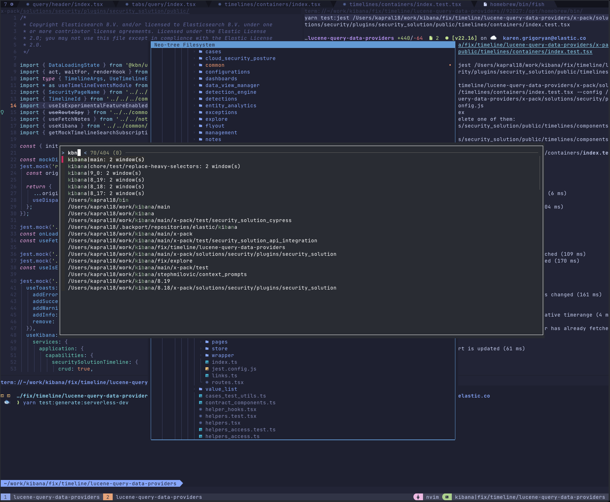

# 🚀 kapral18/dotfiles

Personal macOS development environment managed with Chezmoi. Keyboard-centric workflow with extensive automation and tool integration.

## 📋 Table of Contents

- [Key Features](#-key-features)
- [Installation](#%EF%B8%8F-installation)
- [Chezmoi & ASDF](#%EF%B8%8F-chezmoi--asdf)
- [Shell Environment](#-shell-fish)
- [Git & 1Password](#-git--1password)
- [Terminal Tools](#-terminals--multiplexers)
- [AI & LLM Integration](#-ai--llm-tools)
- [Neovim](#-neovim)
- [macOS Automation](#%EF%B8%8F-macos-automation)

## ✨ Key Features

| Feature                | Description                                      |
| ---------------------- | ------------------------------------------------ |
| 🤖 **Agent Memory**    | Beads integration for AI task tracking           |
| 🔐 **Secure Identity** | 1Password SSH agent with work/personal switching |
| 🌳 **Git Worktrees**   | Worktree management with PR integration          |
| 💎 **Neovim**          | Custom LSP, AI commits, refactoring tools        |
| 🐚 **Fish Shell**      | 30+ custom productivity functions                |
| 📦 **Brewfile**        | 250+ formulas and casks                          |
| ⚙️ **ASDF**            | Version manager with automatic switching         |

---

## 🛠️ Installation

### Prerequisites

1. **Install 1Password**: Required for SSH agent and secret management.

### Bootstrap

```bash
sh -c "$(curl -fsLS get.chezmoi.io/lb)" -- init --apply kapral18
```

### What Happens?

1. Chezmoi installs and initializes from this repository
2. Prompts for:
   - Primary email and SSH public key
   - Secondary credentials (if personal machine)
   - Work machine confirmation
   - PGP cache TTL preference
3. Applies all dotfiles, scripts, and configs
4. Installs Homebrew packages
5. Configures language version managers (cargo, go, npm, uv)
6. Applies macOS system preferences

---

## 🏛️ Chezmoi & ASDF

### Chezmoi

Configuration management with templates and scripts.

**Key Concepts:**

- **Conditional Logic (`.isWork`)**: Templates use `{{ .isWork }}` to handle:
  - Different Git identities and SSH keys
  - Work-specific ASDF plugins
  - Separate Homebrew cask installations
  - Different PGP cache timeouts

- **Executable Scripts**: Files with `executable_` prefix go to `~/bin`:

  ```
  home/exact_bin/executable_f-wtree → ~/bin/f-wtree
  ```

- **Automated Hooks**: Scripts in `.chezmoiscripts/` run automatically:
  - `run_once_before_*` - One-time setup (e.g., Xcode installation)
  - `run_once_after_*` - One-time post-install (e.g., Homebrew setup)
  - `run_onchange_after_*` - Run when template changes (e.g., package updates)

### ASDF

Version manager for languages and tools.

**How it works:**

1. **Declarative Plugins** (`asdf_plugins.tmpl`): Conditionally install plugins

   ```
   nodejs
   ruby
   {{ if ne .isWork true }}lua{{ end }}
   ```

2. **Version Pinning** (`.tool-versions.tmpl`): Pin tool versions

   ```
   nodejs 20.11.0
   ruby 3.2.2
   ```

3. **Automatic Switching**: `cd` into a project and the right versions activate via ASDF shims.

---

## 🐚 Shell: Fish

Fish is the primary shell, with Zsh and Bash also configured.

### Git Worktree Management

Git worktree helpers for easier branch management.

#### `f-wtree add <branch> [base_branch]`

Create worktrees from:

- Existing local branches
- Remote branches (`origin`, `upstream`)
- Fork branches (`f-wtree add user/branch`)
- New branches from `HEAD`
- Nested directories for `feature/new-ui` → `../feature/new-ui/`

#### `f-wtree prs <pr_numbers_or_search>`

PR reviewer workflow:

1. Search by PR number or keywords
2. Select with `fzf` (shows diff, description, CI status)
3. Fetch PR metadata via GitHub API
4. Add contributor's fork temporarily
5. Create worktree for PR branch
6. Launch named tmux session

#### `f-wtree remove`

Interactive cleanup:

- Removes worktree directories
- Deletes local branches
- Cleans up fork remotes
- Removes empty parent directories
- Purges paths from zoxide
- Kills tmux sessions

### Custom Functions

30+ scripts in `~/bin`:

| Script                      | Purpose                                   |
| --------------------------- | ----------------------------------------- |
| `f-add-patch-to-prs`        | Add `.patch` files to PRs                 |
| `f-appid`                   | Get macOS bundle identifiers              |
| `f-apply-app-icons`         | Apply custom app icons from YAML          |
| `f-check-backport-progress` | Check backport status                     |
| `f-cp-files-for-llm`        | Concatenate project files for LLM context |
| `f-fuzzy-brew-search`       | Interactive Homebrew search               |
| `f-gh-subissues-create`     | Create GitHub sub-issues                  |
| `f-history-sync`            | Sync fish history via 1Password           |
| `f-list-prs`                | Advanced PR filtering                     |
| `f-pdf-diff`                | Visual PDF comparison                     |
| `f-tmux-lowfi`              | Control `lowfi` music player              |
| `f-to-gif` / `f-vid-ipad`   | Video processing                          |

All scripts include error handling, `--help` text, and Fish completions.

---

## 🔐 Git & 1Password

### 1Password SSH Identity

Manage separate Git identities (personal/work) automatically.

#### How It Works

1. Global config sets `sshCommand = ssh -o IdentityFile="~/.ssh/primary_public_key.pub"`
2. Points to **public key** (safe on disk)
3. 1Password SSH agent fetches matching **private key** from vault
4. Conditional include `[includeIf "gitdir:~/work/"]` loads work config
5. Work config points to `work_public_key.pub` for different private key

Result: Automatic identity switching based on directory, no private keys on disk.

### Git Configuration

**Aliases:**

- `git wtgrab <worktree>` - Transfer uncommitted changes between worktrees
- `git squash <n>` - Interactive squash
- `git u` - Fetch, rebase, and prune
- `git hide` / `unhide` - Ignore local changes to tracked files

**Defaults:**

- `rerere` - Auto-resolve repeated conflicts
- `rebase.autoSquash = true`
- `rebase.updateRefs = true`
- `diff.algorithm = histogram`
- `merge.conflictStyle = zdiff3`
- `feature.manyFiles = true`

### Git Tools

**gh-dash**: Terminal UI for GitHub PRs and issues

- Separate views for work/personal repos
- Custom filters and layouts
- Config: `home/dot_config/exact_gh-dash/config.yml`

**TUIs:**

- **gitui** - Fast keyboard-driven UI
- **lazygit** - Simple terminal interface
- **tig** - History viewer

---

## 💻 Terminals & Multiplexers

### Tmux

**Prefix**: `C-Space`

**Plugins:**

| Plugin                              | Function                       |
| ----------------------------------- | ------------------------------ |
| `tpm`                               | Plugin manager                 |
| `tmux-resurrect` + `tmux-continuum` | Auto-save sessions every 15min |
| `tmux-pain-control`                 | Pane resize/swap               |
| `tmux-sessionist`                   | Session switching              |
| `tmux-fzf-url`                      | Extract URLs from scrollback   |
| `tmux-theme-catppuccin`             | Theme                          |

**Neovim Integration:**

- `Ctrl-Shift-h/j/k/l` - Passthrough to Neovim
- Vi mode for navigation and copy

### Ghostty

Default terminal emulator (GPU-accelerated).

Config (`home/dot_config/exact_ghostty/config`):

- Hidden titlebar, no shadows
- JetBrainsMono Nerd Font 14pt
- Copy-on-select
- Shell integration

### Fish LSP

Language server for Fish scripts:

- Completions
- Syntax checking
- Go-to-definition
- Diagnostics

---

## 🤖 AI & LLM Tools

AI tools for CLI and editor. Credentials in 1Password, configs in repo.

| Tool           | Purpose                 | Config                                       |
| -------------- | ----------------------- | -------------------------------------------- |
| **Crush**      | Terminal AI assistant   | Charmbracelet tap                            |
| **Ollama**     | Local LLM runtime       | `run_onchange_after_05-add-ollama-models.sh` |
| **Amp**        | AI coding tool with MCP | `home/dot_config/amp/settings.json`          |
| **Cursor**     | AI code editor (work)   | `.isWork` conditional                        |

**Ollama Models**:

- `gpt-oss`
- `deepseek-r1`

**Neovim Integration**:

- AI commit message generation
- Backends: Ollama, Cloudflare AI, OpenRouter

---

## 💎 Neovim

Custom IDE setup.

### UI & Keymaps

| Feature            | Description                                            |
| ------------------ | ------------------------------------------------------ |
| **Dynamic Winbar** | Project-relative file paths                            |
| **Smart Tab**      | Copilot → snippets → bracket jumping                   |
| **Minimal View**   | Conceal long `className` to `…`                        |
| **Keymaps**        | `jk`→ESC, `Alt-j/k` jump 10, `Ctrl-Alt-j/k` move lines |

### Development Tools

#### Jest Runner (`run-jest-in-split.lua`)

- Run `describe`/`it` block under cursor
- Handle parameterized tests
- Debug mode
- Update snapshots

#### AI Commits (`summarize-commit.lua`)

Generate commit messages from staged changes:

- Backends: Ollama, Cloudflare AI, OpenRouter
- Conventional commits format

#### TypeScript Refactoring (`ts-move-exports.lua`)

Move code to new files:

1. Select exported code
2. Specify target file
3. Auto-update import paths

#### Source/Test Toggle (`switch-src-test.lua`)

Jump between source and test files with `Ctrl-^`.

### Utilities

- `LargeFiles` - Find files by line count
- `CpFromDownloads` - Copy from Downloads
- `owner-code-search` - Search by CODEOWNERS
- `show-file-owner` - Display file owner

---

## 🖥️ macOS Automation

### Hammerspoon

Lua-based automation.

#### Grid Mouse (`gridmouse.lua`)

Keyboard mouse control:

- `h/j/k/l` to move cursor
- Grid mode for precise positioning

#### Window Management (`window.lua`)

Hyper key + movement:

- `Hyper + h` - Snap left
- `Hyper + l` - Snap right
- `Hyper + k` - Snap top
- `Hyper + j` - Snap bottom
- `Hyper + m` - Maximize

### Custom App Icons

Script: `f-apply-app-icons`

1. YAML mapping (`app_icons/icon_mapping.yaml`)
2. Uses `fileicon` to apply icons
3. Assets in `app_icons/assets/`

---

## 📦 Package Management

| System       | File                                      | Purpose                      |
| ------------ | ----------------------------------------- | ---------------------------- |
| **Homebrew** | `readonly_dot_Brewfile.tmpl`              | macOS apps, CLI tools, fonts |
| **Cargo**    | `readonly_dot_default-cargo-crates`       | Rust packages                |
| **Go**       | `readonly_dot_default-golang-pkgs`        | Go tools                     |
| **Gems**     | `readonly_dot_default-gems`               | Ruby packages                |
| **npm**      | `readonly_dot_default-npm-pkgs`           | Node.js globals              |
| **uv**       | `readonly_dot_default-uv-tools.tmpl`      | Python tools                 |
| **Manual**   | `readonly_dot_default-manual-packages.tmpl` | DMGs + GitHub releases |

Install scripts run via chezmoi hooks when files change.

---

## 🔄 Workflow

### Typical Day

1. Tmux sessions auto-restore
2. `f-wtree add feature/new-ui` - new worktree + tmux session
3. `f-wtree prs 12345` - checkout PR
4. Jest runner in Neovim
5. AI-generated commit
6. `f-wtree remove` - cleanup

### Update Packages

```bash
brew update && brew upgrade
chezmoi apply
```

### Sync to New Machine

```bash
sh -c "$(curl -fsLS get.chezmoi.io/lb)" -- init --apply kapral18
```

---

## 📚 Further Reading

- Chezmoi configs: `home/`
- Neovim: `home/dot_config/exact_nvim/`
- Fish: `home/dot_config/fish/`
- Scripts: `home/exact_bin/`
- Brewfile: `home/readonly_dot_Brewfile.tmpl`

See also: `AGENTS.md` for AI agent instructions
