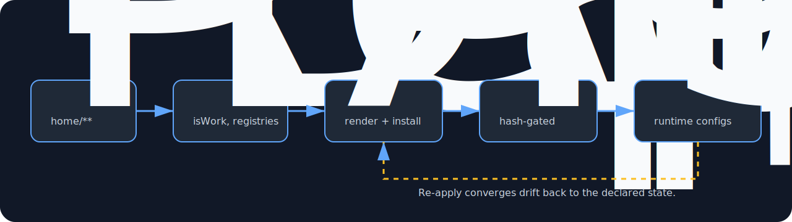

# Architecture

This setup is a `chezmoi` source directory. `chezmoi` renders templates and copies files into your `$HOME`.

## Repository Layout

- [`home/`](../../home/) is the source-of-truth for files that end up in your home directory.
- [`home/.chezmoiscripts/`](../../home/.chezmoiscripts/) contains automation hooks that run during apply.
- [`home/.chezmoi.toml.tmpl`](../../home/.chezmoi.toml.tmpl) defines interactive prompts and computed values.
- [`home/.chezmoiexternal.toml`](../../home/.chezmoiexternal.toml) pulls a few external assets (git repos/archives).

## Documentation Hygiene

This repo treats `docs/` as part of the configuration:

- If you change dotfiles behavior (anything under [`home/`](../../home/) that affects commands or workflows), update `docs/` in the same change.
- If a change truly has no user-facing impact, record that in the PR/commit context so the docs/code divergence is explicit.

## Repo-Only Assets (Not Installed Into `$HOME`)

Some directories in [`home/`](../../home/) are intentionally ignored by `chezmoi` and are used as "repo-local data" for scripts.

Ignore rules live in:

- [`home/.chezmoiignore`](../../home/.chezmoiignore)

Examples in this setup:

- [`home/app_icons/`](../../home/app_icons/) is used by the `,apply-app-icons` script, but it is not installed into `$HOME`.
- [`home/Alfred.alfredpreferences/`](../../home/Alfred.alfredpreferences/) is stored in the repo, but not automatically applied.

## Chezmoi Naming Conventions (How Source Maps To Installed Files)

Chezmoi uses filename conventions to decide where things land.

Common patterns in this setup:

- Paths under [`home/dot_config/`](../../home/dot_config/) map to `~/.config/...`
- [`home/exact_lib/...`](../../home/exact_lib/) -> `~/lib/...` for deployed command internals
- `home/dot_*` maps to `~/.<name>` (for example: [`home/dot_zsh/`](../../home/dot_zsh/) -> `~/.zsh/`)
- Paths under [`home/private_dot_ssh/`](../../home/private_dot_ssh/) map to `~/.ssh/...` (and are treated as private by chezmoi)
- `executable_foo` -> installs as an executable file named `foo`
- `readonly_foo` -> installs as `foo` with `0444` permissions (read-only); used for config files that should not be modified by external tools at runtime
- `exact_` prefix in a directory name means "exact directory" (chezmoi does not merge it with existing contents)

This is why you may see paths like:

- [`home/dot_config/exact_nvim/exact_lua/`](../../home/dot_config/exact_nvim/exact_lua/) in the repo
- but `~/.config/nvim/lua/` on disk

## The Data Flow

This setup is intentionally declarative:

1. You answer prompts in [`home/.chezmoi.toml.tmpl`](../../home/.chezmoi.toml.tmpl).
2. Templates in [`home/`](../../home/) render differently depending on those values.
3. Hooks in [`home/.chezmoiscripts/`](../../home/.chezmoiscripts/) install / update tools based on the rendered config.
4. Re-running `chezmoi apply` converges you back to the intended state.

## Dynamic AI Context Merging

Because AI tools (like OpenCode, Cursor, Gemini, and Pi) often rewrite their config files during runtime, rendering templates directly into those files causes conflicts. Instead, this architecture uses **Profile-Based Merging**:

- MCP server definitions share a single canonical registry at [`home/.chezmoidata/mcp_servers.yaml`](../../home/.chezmoidata/mcp_servers.yaml). Each entry declares a `work_only` flag so work-specific servers are filtered at generation time.
- During `chezmoi apply`, the unified script `run_onchange_after_07-generate-mcp-configs.sh.tmpl` calls [`scripts/generate_mcp_configs.py`](../../scripts/generate_mcp_configs.py) once and writes the result to Cursor, Claude Code, Pi, and any other tool that consumes the standard `mcpServers` JSON shape.
- Tools with different MCP schemas (OpenCode, Codex) still derive from the same registry via small inject scripts in `scripts/` that transform the canonical registry into the tool-specific config shape.
- Gemini keeps its own settings file, but the `mcpServers` section is injected from the same registry at apply time.
- This creates a hard boundary between work contexts (which load work-specific MCP servers) and personal contexts.

The same pattern applies to model definitions. For the full picture see [MCP servers](../topics/ai-assistants/mcp.md), [Model registry & routing](../topics/ai-assistants/model-registry.md), and [Tool configs](../topics/ai-assistants/tool-configs/index.md).

### Shared Library (`scripts/chezmoi_lib.sh`)

All `run_onchange_after_07-merge-*` scripts source a shared shell library at [`scripts/chezmoi_lib.sh`](../../scripts/chezmoi_lib.sh) for common operations:

| Function                       | Purpose                                               |
| ------------------------------ | ----------------------------------------------------- |
| `chezmoi_pick_src`             | Resolve work vs personal source path                  |
| `chezmoi_write_if_changed`     | Atomic string write, skip if content unchanged        |
| `chezmoi_install_if_changed`   | File copy via `install(1)`, skip if content unchanged |
| `chezmoi_get_litellm_api_base` | Fetch and normalize LiteLLM URL from `pass`           |
| `chezmoi_record_checksum`      | Record one literal target and sha256 in the manifest  |
| `chezmoi_forget_checksum`      | Retire one literal target from the manifest           |
| `chezmoi_record_artifact`      | Record one ownership-aware generated AI artifact      |
| `chezmoi_forget_artifact`      | Retire one generated AI artifact id                   |

Two independent runtime ledgers serve different questions:

- `~/.local/state/chezmoi/managed_configs.tsv` is the generic literal whole-file checksum manifest. [`scripts/managed_config_manifest.py`](../../scripts/managed_config_manifest.py) collapses exact duplicate rows and powers the existing `,doctor` Config Drift section.
- `~/.local/state/chezmoi/generated_artifacts.v1.json` is the AI-specific effective-state ledger. [`scripts/generated_artifact_ledger.py`](../../scripts/generated_artifact_ledger.py) records source/transform hashes, selected profile, ownership projection, target, consumer, and local probe metadata. `,doctor ai` reads it, so runtime-owned Codex/Copilot fields do not create false drift.

Both ledgers are atomic and mode `0600`. The AI ledger stores paths and hashes only, never generated config contents or resolved secret values.

To add a new AI tool config, create work/personal source files and a merge script that sources the library — typically 5–10 lines of tool-specific logic.

## Hooks (Automation)

The most important concept for understanding "what happens" is the hook naming:

- `run_once_before_*` runs once before apply work.
- `run_once_after_*` runs once after apply work.
- `run_onchange_after_*` runs after apply _when the tracked inputs change_.

Examples in this repo:

| Hook                                                                                                                                                             | Purpose               |
| ---------------------------------------------------------------------------------------------------------------------------------------------------------------- | --------------------- |
| [`home/.chezmoiscripts/run_once_before_00-install-xcode.sh`](../../home/.chezmoiscripts/run_once_before_00-install-xcode.sh)                                     | Xcode CLT             |
| [`home/.chezmoiscripts/run_once_after_01-install-brew.sh`](../../home/.chezmoiscripts/run_once_after_01-install-brew.sh)                                         | Homebrew install      |
| [`home/.chezmoiscripts/run_once_after_02-install-fish.sh`](../../home/.chezmoiscripts/run_once_after_02-install-fish.sh)                                         | Fish install          |
| [`home/.chezmoiscripts/run_onchange_after_03-install-brew-packages.fish.tmpl`](../../home/.chezmoiscripts/run_onchange_after_03-install-brew-packages.fish.tmpl) | Brew bundle           |
| [`home/.chezmoiscripts/run_onchange_after_05-install-mise-runtimes.sh.tmpl`](../../home/.chezmoiscripts/run_onchange_after_05-install-mise-runtimes.sh.tmpl)     | mise runtimes + shims |
| [`home/.chezmoiscripts/run_onchange_after_05-install-uv-versions.sh.tmpl`](../../home/.chezmoiscripts/run_onchange_after_05-install-uv-versions.sh.tmpl)         | UV Python versions    |

Many hooks embed `sha256sum` comments that reference template content. The AI/config `07` hooks include every directly or transitively executed local transform, so changing a shared parser, reconciler, or shell helper schedules the affected projection again.

The [Reference map](../reference/reference-map.md) lists every hook and helper script and the file each one drives.

## Work vs Personal Split

The primary decision point is the `isWork` prompt in [`home/.chezmoi.toml.tmpl`](../../home/.chezmoi.toml.tmpl). It is used to:

- conditionally include certain tools/plugins
- choose which identity config is rendered
- choose which secrets/setup steps run

## External Assets

[`home/.chezmoiexternal.toml`](../../home/.chezmoiexternal.toml) is used for things you want updated regularly but don't want to vendor into your dotfiles repo.

Current externals:

| External           | Purpose                     |
| ------------------ | --------------------------- |
| `tpm`              | tmux plugin manager         |
| `EmmyLua.spoon`    | Hammerspoon Lua annotations |
| `lowfi` data files | Background music tracklists |
| `bat` themes       | Syntax highlighting themes  |
