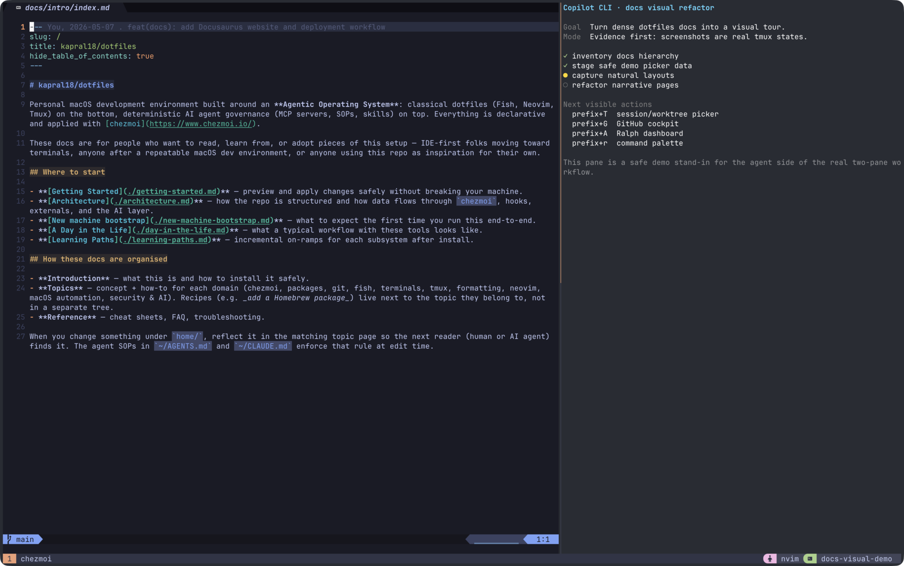
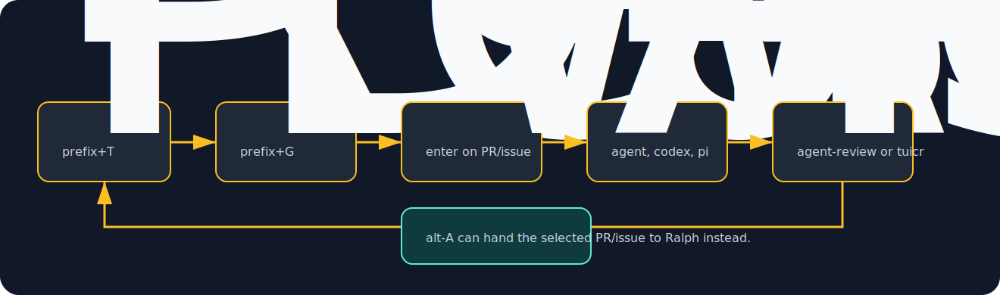
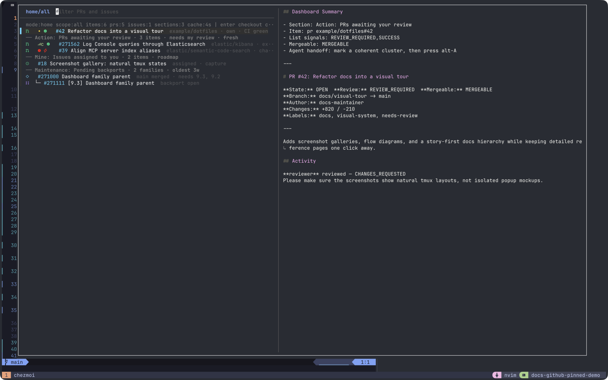
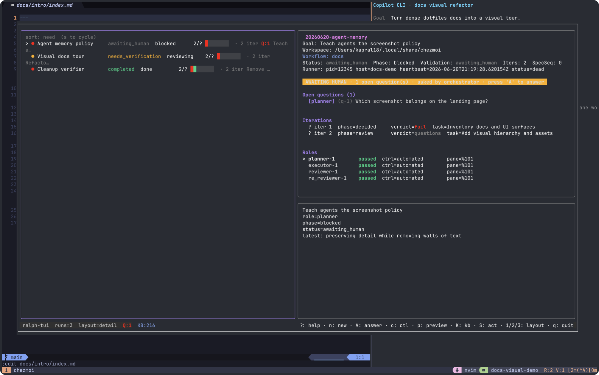
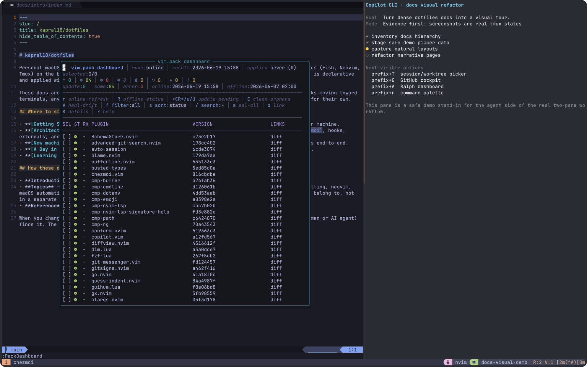

# A Day In The Life

This page is for people coming from a traditional IDE workflow who want to see what "terminal-driven" can look like. The workbench is one **tmux** window: Neovim in a normal pane, an assistant or shell next to it, and focused popups only when a workflow needs a picker.



Two fzf popups do most of the navigation:

- the **[session picker](../topics/workflow/tmux/session-picker.md)** (`prefix` + `T`) for navigating, creating, switching, and killing sessions
- the **[GitHub picker](../topics/workflow/tmux/github-picker.md)** (`prefix` + `G`) for issues and PRs

Both wrap the lower-level comma commands (`,w`, `,gh-worktree`) so you rarely type them by hand — the pickers handle worktree creation, session naming, and linking for you. `prefix` is `Ctrl-Space`; tmux config is [`home/dot_config/exact_tmux/readonly_tmux.conf`](../../home/dot_config/exact_tmux/readonly_tmux.conf).

## Morning: Restore Context

Open the session picker (`prefix` + `T`). It lists your tmux sessions, git worktrees, and recent directories in one place, with inline badges for dirty state, linked PRs/issues, and CI status. The preview pane shows the last screen of each session, so you can see where you left off and jump straight back in with `enter`.


## Navigate, Create, Switch, And Kill Sessions

The session picker is the daily driver — not raw `,w` commands:

- `enter` — switch to a session, or create one for a worktree/directory row (it derives a canonical session name and attaches automatically)
- `tab` — multi-select rows for batch actions
- `ctrl-x` — kill the selected session(s)
- `alt-x` — remove the selected worktree(s) (won't tear down your current session)
- `ctrl-s` — send a command to the selected session(s) without switching
- `alt-p` / `alt-i` — open the row's linked PR / issue in the browser

Because it indexes worktrees on disk, the sessions you create with `,w` (or via the GitHub picker) show up here automatically. See [Session picker](../topics/workflow/tmux/session-picker.md) and [Worktrees](../topics/workflow/git-identity/worktrees.md).

## Work The GitHub Dashboard

Open the GitHub picker (`prefix` + `G`) for a PR/issue dashboard with review/CI badges, hierarchy (epics, backport families), and inline actions. Switch scope with `alt-1` (Focus: work you own or must act on) and `alt-2` (Explore: team queues, mentions, radar), and toggle work/home with `ctrl-s`.





From the dashboard, without leaving tmux:

- **Create tickets** — `alt-i` opens `$EDITOR` to file a new issue; `alt-E` files an epic (parent + sub-issues).
- **Clone and check out** — `enter` on a PR/issue creates a worktree and focuses its session. If the repo isn't local yet, it's bootstrapped first (`,gh-tfork`), so cloning, worktree creation, session creation, and issue↔branch linking all happen in one step. `ctrl-t` batches this across marked rows.
- **Act on PRs** — `alt-x` opens a command palette (approve, request-changes, merge, label, comment, request review); `alt-c` adds a comment; `alt-b` checks out and opens an Octo review; `alt-o` opens in the browser.
- **Hand off to Ralph** — `alt-A` seeds a `,ralph go` goal with the selected PR/issue context (see below).

`alt-g` switches between this dashboard and the session picker in place. See [GitHub picker](../topics/workflow/tmux/github-picker.md).

## Agentic Tasks: Offload Work To Assistants

Assistants are governed by a version-controlled SOP + skills layer, so behavior is consistent across tools and respects each repo's rules. See [The Agentic Operating System](../topics/ai-assistants/index.md).

The CLI assistants, in the order this setup leans on them:

1. **Cursor CLI** (`cursor-agent`, aliased `agent`) — the primary interactive harness.
2. **Codex** (`,codex`)
3. **Pi** (`pi`)
4. **Claude Code** (`claude`)

```bash
agent      # Cursor CLI (primary)
,codex
pi
claude
```

Per-tool configuration (auth, models, MCP, profile merging) lives in [Tool configs](../topics/ai-assistants/tool-configs/index.md). When you run `claude`, `cursor-agent`, `pi`, or `copilot` inside tmux, `Alt-Enter` prepends a calibrated verification scaffold and leaves the prompt editable (toggle with `prefix` + `W`); plain `Enter` is never touched.

For larger, multi-step work, hand off to **Ralph** — a planner → executor → reviewer → re-reviewer loop with self-healing — with `,ralph go` (or `alt-A` from the GitHub picker). See [Ralph orchestrator](../topics/ai-assistants/ralph/index.md).



Across sessions, agents carry context through two memory layers: short-lived per-workspace hook memory (`/tmp/specs`) and a durable knowledge base (`,ai-kb`). See [Agent memory](../topics/ai-assistants/knowledge-base/index.md).

## Review

- Use `alt-b` in the GitHub picker to check out a PR and open an Octo review in a new window.
- To review the changes an agent produced before committing, use the `tuicr` diff loop, which feeds structured feedback back to the agent. See [Reviewing agent diffs](../topics/ai-assistants/reviewing-diffs.md).

## Code: Keep Your Editor

You can run this whole workflow from VSCode/JetBrains using the integrated terminal — the pickers and assistants are just tmux popups and CLIs. Neovim is available if you want it, but it is optional.

When Neovim is the editor, it stays inline. Tool-specific UI, such as the `vim.pack` dashboard, opens inside Neovim rather than as a separate tmux popup.



## Cleanup

There's no separate teardown step: kill sessions with `ctrl-x` and remove finished worktrees with `alt-x` directly from the session picker as you go.

## Maintenance

Update dotfiles:

```bash
chezmoi update
```

Update packages, then reconverge:

```bash
brew update
brew upgrade
chezmoi apply
```
