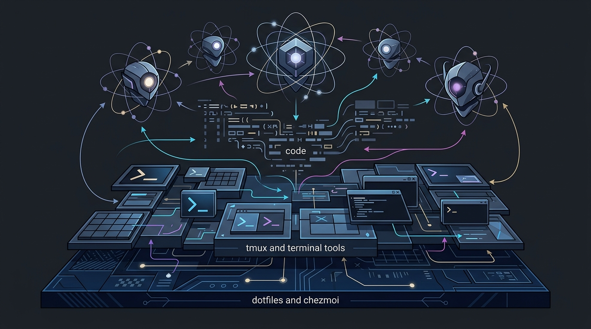
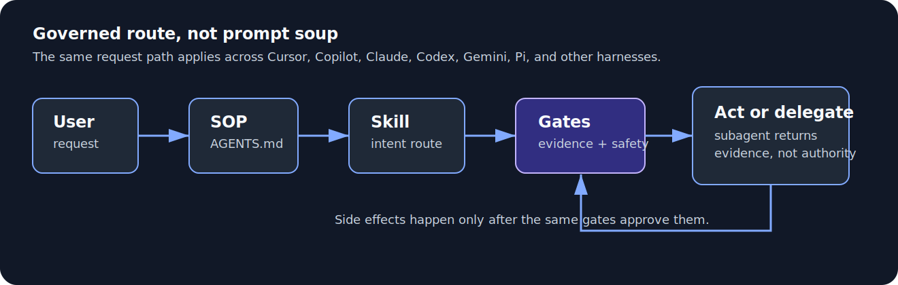

# The Agentic Operating System (AI & Assistants)

This setup treats assistant behavior as strict, version-controlled configuration installed alongside the rest of the dotfiles. The goal is deterministic, verifiable behavior instead of relying on unpredictable LLM defaults.



At a high level, the AI layer is a set of governed routes, not a pile of prompts:



## Governance layer

Entrypoints installed into `$HOME`:

| Source                                                                                              | Target                         | Notes                    |
| --------------------------------------------------------------------------------------------------- | ------------------------------ | ------------------------ |
| [`home/readonly_AGENTS.md`](../../../home/readonly_AGENTS.md)                                       | `~/AGENTS.md`                  | Single SOP source        |
| [`home/symlink_CLAUDE.md`](../../../home/symlink_CLAUDE.md)                                         | `~/CLAUDE.md`                  | Symlink to `~/AGENTS.md` |
| [`home/dot_gemini/symlink_GEMINI.md`](../../../home/dot_gemini/symlink_GEMINI.md)                   | `~/.gemini/GEMINI.md`          | Symlink to `~/AGENTS.md` |
| [`home/dot_cursor/symlink_AGENTS.md`](../../../home/dot_cursor/symlink_AGENTS.md)                   | `~/.cursor/AGENTS.md`          | Symlink to `~/AGENTS.md` |
| [`home/dot_config/opencode/symlink_AGENTS.md`](../../../home/dot_config/opencode/symlink_AGENTS.md) | `~/.config/opencode/AGENTS.md` | Symlink to `~/AGENTS.md` |

There is one real SOP file. Claude, Gemini, Cursor, and OpenCode read symlinks that resolve to it, so the always-on instruction layer stays identical across harnesses.

The SOP is important enough to have its own section: [System Prompt (SOP)](system-prompt/index.md).

## Skills and routing

Skills live under `~/.agents/skills/`; the chezmoi source is [`home/exact_dot_agents/exact_skills/`](../../../home/exact_dot_agents/exact_skills/). See [Skills](skills/index.md) for the per-skill catalog.

## Core workflow: change a skill

1. Edit files under:

   ```text
   home/exact_dot_agents/exact_skills/
   ```

2. Apply and verify:

   ```bash
   chezmoi diff
   chezmoi apply
   ls -la ~/.agents/skills
   ```

## Subsystems

| Subsystem                              | Page                                            |
| -------------------------------------- | ----------------------------------------------- |
| System prompt / SOP                    | [System Prompt (SOP)](system-prompt/index.md)   |
| Skills list and routing contract       | [Skills](skills/index.md)                       |
| Subagent runtime profiles              | [Cross-harness subagents](subagents.md)         |
| Review skill and agent-review topology | [Review workflow](reviews/index.md)             |
| Hook memory + durable AI KB            | [Agent memory](knowledge-base/index.md)         |
| Ralph planner/executor/reviewer loop   | [Ralph orchestrator](ralph/index.md)            |
| Canonical MCP registry                 | [MCP servers](mcp.md)                           |
| Model registry and routing             | [Model registry & routing](model-registry.md)   |
| Per-tool config rendering              | [Tool configs](tool-configs/index.md)           |
| RTK output compaction                  | [RTK token optimization](rtk.md)                |
| Local llama.cpp inference              | [llama.cpp local inference](llama-cpp/index.md) |
| Reviewing agent diffs                  | [Reviewing agent diffs](reviewing-diffs.md)     |

## Safety boundaries

- Keep assistant instructions declarative and repo-local.
- Keep generic AI workflows, setup, skills, hooks, and subagent profiles domain-neutral. Repo/org/product specifics live in verified domain overlays or dedicated domain skills.
- Keep secrets in `pass` or local private config, not tracked markdown.
- Validate generated automation commands before state-changing actions.
- Treat RTK-compacted command output as a recoverable index, not the full output. When output shows `[full output: …]` or `… +N more`, fetch the full output before relying on it. See [RTK token optimization](rtk.md).

## Verification and troubleshooting

High-signal checks:

```bash
chezmoi diff
chezmoi apply
ls -la ~/.agents/skills
```

If behavior is not picking up expected instructions:

- verify the correct entrypoint exists in `$HOME`.
- verify skill files exist under `~/.agents/skills/`.
- verify runtime secrets expected from `pass` are present.

## Related

- [Switching work/personal identity](../workflow/git-identity/switch-identity.md)
- [Security and secrets](../security/security-and-secrets.md)
- [Reference map](../../reference/reference-map.md)
