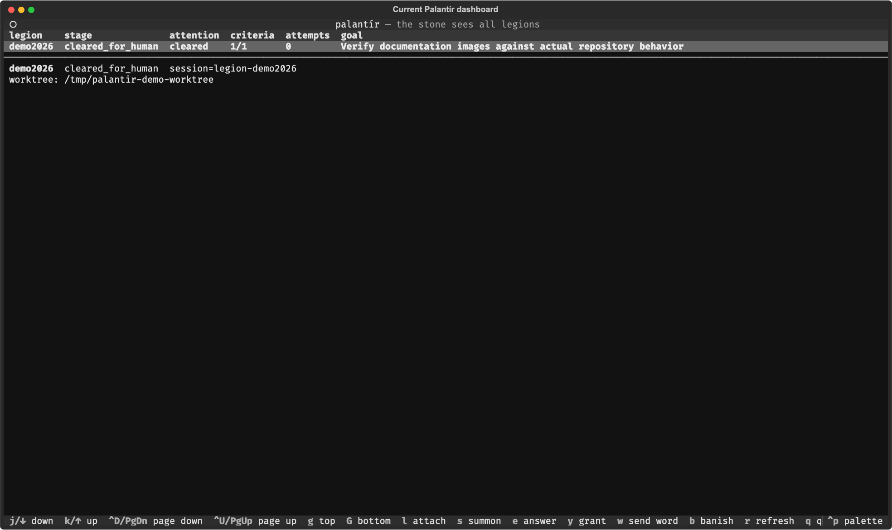

# Palantír orchestrator

`,palantir` is the tmux-native long-work orchestrator. It treats one effort as one **legion**: a disposable `,w` worktree, a dedicated tmux session, a deterministic supervisor, and interactive role panes that do the judgment-heavy work under normal SOP and skill governance.

The name is literal: the dashboard is the seeing stone for long-running work. It shows what each legion is doing, which stage is active, whether the run is waiting on a human, and whether the machine checks are green enough for a human to take over.



_Rendered from the current dashboard source against a sanitized one-legion fixture; no UI or text was generated._

## Model

| Unit             | Meaning                                                                                                                                             |
| ---------------- | --------------------------------------------------------------------------------------------------------------------------------------------------- |
| Legion           | One effort. It owns one tmux session, one manifest, one worktree unless `--no-worktree` is used, and one stage timeline.                            |
| Session          | The tmux container for the effort. Window 0 is `command`: coordinator agent pane plus deterministic supervisor pane.                                |
| Stage window     | A tmux window dedicated to one stage such as `implement`, `adversarial_review`, or `verify`.                                                        |
| Coordinator pane | A persistent agent harness that receives structured `[palantir]` events and makes judgment calls that the deterministic supervisor must not invent. |
| Supervisor pane  | The Python control loop. It owns lifecycle, state transitions, retries, wake dedupe, and safety guards without putting an LLM in the control path.  |

The implementation follows the repo's thin-launcher pattern: `~/bin/,palantir` dispatches into `~/lib/,palantir/`. The chezmoi source lives at `home/exact_bin/executable_,palantir`, `home/exact_lib/exact_,palantir/`, and the Fish completion lives at `home/dot_config/fish/completions/readonly_,palantir.fish`.

## Stage machine

A normal legion advances left to right:

```text
summon → triage → diagnose → investigate → implement → adversarial_review → verify → cleared_for_human
```

`diagnose` and `investigate` are used when the goal needs them; straightforward implementation work can move from `triage` to `implement`.

Two non-success states matter:

| State      | Meaning                                                                                                              |
| ---------- | -------------------------------------------------------------------------------------------------------------------- |
| `holding`  | The legion is parked because a role asked a question, a premise needs human input, or the retry budget is exhausted. |
| `banished` | Terminal state after explicit teardown or final closure.                                                             |

The supervisor enforces the hard guards:

- `adversarial_review` cannot clear the same model family that implemented the change.
- `verify` is machine-run acceptance criteria only: command exit 0 is green, nonzero is red or blocked with evidence.
- `cleared_for_human` is reachable only after green verify and zero review blockers.
- A verify failure wakes `implement` with bounded evidence, up to `max_implement_attempts`, then parks the legion in `holding`.
- Repeated identical wake states are deduped, so the coordinator sees one actionable event instead of log spam.
- Pane input is fail-closed: only composer `empty` authorizes injection; `pending`, `busy`, and `unknown` wait and retry without advancing the stage.
- Role harnesses carry `PALANTIR_AGENT_ROLE`; the dispatcher and supervisor refuse agent-originated `grant` and `banish` events, keeping clearance and teardown human-only.

## Hybrid control

Palantír splits control and judgment deliberately.

| Owner                    | Responsibilities                                                                                                                                              |
| ------------------------ | ------------------------------------------------------------------------------------------------------------------------------------------------------------- |
| Deterministic supervisor | Manifest reads/writes, tmux pane/window creation, stage transitions, retry counters, wake dedupe, verify execution, statusline data, and terminal state.      |
| Coordinator agent        | Decides how to respond to blockers, how to interpret review feedback, when to send word to a role, and what to tell the human when a real decision is needed. |
| Role panes               | Run interactive harness CLIs such as Copilot by default, with role-specific settings from `~/.config/palantir/config.toml`.                                   |

The deterministic loop never asks an LLM to decide whether a state transition is safe. It emits structured `[palantir]` event lines into the coordinator pane when human-like judgment is needed, and it waits for role result files for stage completion.

## Role harnesses and family diversity

Role configuration lives in `~/.config/palantir/config.toml`. It selects the harness command and model for each role while keeping the control loop harness-agnostic.

Family diversity is a summon-time requirement. The `adversarial_review` role must use a different model family than `implement`; if the configured families match, summon refuses to start the legion. The point is not variety for its own sake: a model family may not be the only judge of the work it just produced.

## Role-supervisor handshake

Each role reports completion by writing a JSON file under the legion state directory:

```text
stages/<stage>.result.json
```

Successful stage shape:

```json
{
  "kind": "stage_result",
  "stage": "implement",
  "verdict": "done",
  "summary": "Implemented the accepted criteria and ran the targeted checks.",
  "blockers": []
}
```

Question shape:

```json
{
  "kind": "question",
  "text": "Which migration path should this use?"
}
```

The supervisor treats the file as the stage boundary. A `question` parks the legion in `holding`; a stage result with blockers cannot clear the review/verify gates until those blockers are resolved. An `adversarial_review` result must state `blockers` explicitly — a clean review writes `"blockers": []`, and a result that omits the field is refused (fail-closed).

## Criteria discipline

Specs should hand Palantír criteria that have already been proven red. The `spec` flow produces criteria JSON from acceptance checks that were run before implementation and observed failing for the right reason. `,palantir summon --criteria '<json>'` consumes that criteria block for detached execution.

During `verify`, Palantír runs the criteria as machine checks. A green status means the configured command exited 0 under the legion worktree. A red status returns evidence to implementation; it does not become a coordinator judgment call.

## Dashboard and tmux surface

| Surface          | Behavior                                                                                              |
| ---------------- | ----------------------------------------------------------------------------------------------------- |
| Bare `,palantir` | Opens the Textual dashboard via `uv run` from the deployed PEP 723 entrypoint.                        |
| `prefix+A`       | Opens the same dashboard in a tmux popup.                                                             |
| Status-right     | Calls `,palantir statusline` and renders `P:n H:n C:n` for progressing, holding, and cleared legions. |
| Tmux config      | `home/dot_config/exact_tmux/exact_conf.d/readonly_45-palantir.conf`.                                  |

The dashboard is Vim-first: `j`/`k` move by row, `Ctrl-D`/`Ctrl-U` move by page, `g`/`G` jump to the first/last legion, and `l` or Enter attaches. Arrow, Page Up/Down, Home, and End remain equivalent accessibility aliases. Use `s`, `e`, `y`, `w`, `b`, `r`, and `q` for summon, answer, grant, send word, banish, refresh, and quit.

## CLI surface

| Command                                                                          | Purpose                                                       |
| -------------------------------------------------------------------------------- | ------------------------------------------------------------- |
| `,palantir`                                                                      | Open the dashboard.                                           |
| `,palantir summon "<goal>" [--criteria '<json>'] [--base <ref>] [--no-worktree]` | Summon a new legion.                                          |
| `,palantir farsee`                                                               | Survey every legion.                                          |
| `,palantir behold <id>`                                                          | Behold manifest-derived status for one legion.                |
| `,palantir send-word <id> [--window W] "<msg>"`                                  | Send structured word into a legion window.                    |
| `,palantir answer <id> "<msg>"`                                                  | Answer a parked question and let the supervisor continue.     |
| `,palantir grant <id>`                                                           | Grant the human clearance gate after reviewing landed output. |
| `,palantir banish <id> [--force]`                                                | Banish and tear down a legion.                                |
| `,palantir keep-watch <id> [--stop]`                                             | Keep or stop the deterministic supervisor watch.              |
| `,palantir trial <id>`                                                           | Put the acceptance criteria to machine trial again.           |
| `,palantir statusline`                                                           | Print the compact tmux status segment.                        |
| `,palantir doctor`                                                               | Check local wiring and configuration.                         |
| `,palantir composer <sub>`                                                       | Access composer helpers.                                      |
| `,palantir state <sub>`                                                          | Inspect or adjust state internals.                            |

## State layout

State lives outside the repo by default:

```text
${PALANTIR_STATE_HOME:-~/.local/state/palantir}/legions/<id>/manifest.json
${PALANTIR_STATE_HOME:-~/.local/state/palantir}/legions/<id>/stages/<stage>.result.json
```

`manifest.json` is the supervisor's source of truth for the legion id, goal, worktree, base ref, active stage, retry counters, role assignments, blocker state, and verify results.

## Memory routing on close

When a legion closes, memory is routed by lifetime and ownership:

| Memory                                                  | Destination                                                |
| ------------------------------------------------------- | ---------------------------------------------------------- |
| Durable reusable learning                               | `,ai-kb remember` with deliberate metadata.                |
| Task-scoped worklog or intent notes                     | `/tmp/specs`.                                              |
| Repo-intrinsic conventions discovered during the effort | The target repo's `AGENTS.md` through the legion worktree. |

Do not store secrets, guesses, or one-off observations in durable memory.

## Where to go deeper

- SOP §8 in `~/AGENTS.md` defines the chat agent's Palantír operating boundary.
- Skill source: `home/exact_dot_agents/exact_skills/exact_palantir/readonly_SKILL.md`.
- State-machine map: `.mermaids/04-palantir-state-machine.mmd`.
- Governed agent runtime flow: `.mermaids/S2-flow-agent-runtime.mmd`.
