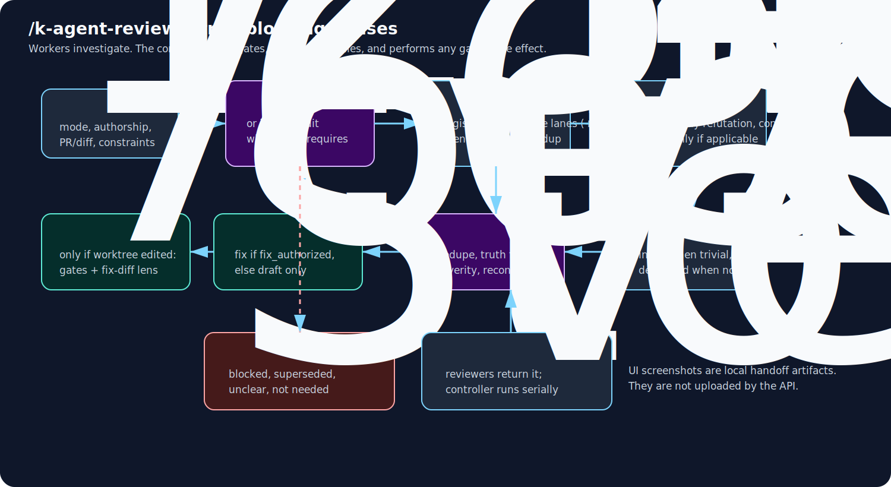
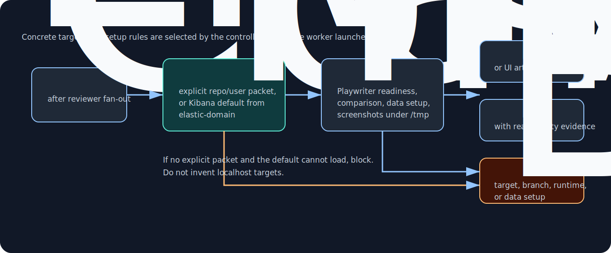

# Multi-agent topology

`/agent-review` is the orchestration entrypoint. Cursor, Copilot, Claude, Codex, and Gemini bridge it through their native isolation mechanisms where available.

The flow is a phased investigation pipeline, not a loose collection of agents. The key invariant is phase ownership: workers investigate; the controller judges and performs any gated side effect.

## Mental model: phase ownership

| Phase                 | Starts only after                                                     | Owns                                                                                          | Stops the flow when                                                                    |
| --------------------- | --------------------------------------------------------------------- | --------------------------------------------------------------------------------------------- | -------------------------------------------------------------------------------------- |
| Route + scope         | user invokes review flow                                              | mode, authorship, target packet, constraints, intent dependencies                             | authorship/scope/intent dependency cannot be resolved safely                           |
| PR necessity / intent | route says PR + other/unknown author, or local changes need PR intent | whether the PR is worth implementation review and whether intent artifacts are current        | PR is blocked, superseded, unclear, not needed, incorrectly open, or intent is unclear |
| Reviewer fan-out      | PR necessity/intent greenlight or non-applicable skip                 | read-only candidate findings and `verification_needed`                                        | every launched lane finishes; individual blockers become controller input              |
| Adversarial verify    | every reviewer lane returned and merged candidates exist              | per-candidate confirmed/refuted/undecidable verdicts on a cross-family model                  | merged candidate set is empty (phase reports skipped)                                  |
| Live UI               | adversarial verification returns and UI/runtime is relevant           | UI reality, required screenshot handoff for feedback candidates, target/runtime/data blockers | target packet, runtime, data, or required screenshots are blocked                      |
| Findings audit        | reviewer + verifier + live UI outputs exist                           | actionability, duplication, gaps, overengineering, verification-ledger audit                  | audit finds no actionable surviving finding or reports blocker                         |
| Controller judgment   | all investigation phases are complete                                 | keep/drop, serial verification ledger, PR pending-review reconciliation                       | unsupported or conflicting payload would be produced                                   |
| Act                   | judgment is complete and blocking ledger items are resolved           | fixes, drafts, gated posting                                                                  | human-visible gate or quality gate blocks                                              |
| Post-act verification | the working tree was edited this flow                                 | quality gates, fix-diff four-dimension stage, carried `verification_needed`                   | setup itself fails or the toolchain is genuinely unavailable                           |

## Using it

### Route and scope

The controller first resolves the route and scope packet: PR/local mode, role, target diff/PR/thread set, base branch, user constraints, expected output, and any intent dependencies needed for judgment.

For other-authored or unknown-author PRs, `pr-necessity-auditor` runs first and blocks fan-out until it greenlights implementation review. It also runs as an intent audit for local changes attached to an assigned/adopted PR when PR body, discussion, Slack, issues, or history are needed to judge the local diff.

PR necessity checks:

- whether the PR is sensible.
- whether it is correctly open.
- whether the work is still needed.
- whether overlapping open/recently merged work exists.
- author intent from PR, references, history, and available GitHub/Slack context.

Review greenlight is separate from merge readiness. Unknown mergeability or failing status checks are reported as status uncertainty, not as "no conflicts".

### Reviewer fan-out

After any required PR necessity greenlight, the controller builds an **angle roster** from scope-level evidence: changed paths and diff stats, never code reading. It launches two to five read-only reviewer lanes in parallel, all on the **registry lane model** for the harness.

Correctness/regressions always runs. Additional implicated angles include tests, types/API, security, performance, deletion-safety, state-machine, product flow, observability, and simplicity.

Angles focus attention but are not ownership boundaries. Verified out-of-angle findings return marked, never dropped.

A **blind fresh-eyes clarity lane** joins the same batch for PR-review and local-changes modes when the diff touches human-maintained code. It receives only the diff scope — no PR body, commit messages, issue text, or prior findings, including on re-runs — loads none of the review methodology, and returns clarity-only findings capped at MEDIUM.

Context that explains confusing code does not refute a fresh-eyes finding. It confirms the context lives in the wrong place, and the controller uses it to pick the fix.

Reviewer lanes are investigation-only:

- they may run deep non-mutating verification.
- they do not edit the worktree.
- they do not seed data or start shared services.
- they do not run generators/formatters/installers.
- they return `verification_needed` when stronger evidence requires mutation or a shared runtime.

The controller tracks those entries in a verification ledger. A ledger item that can flip a keep/drop/action decision stays blocking until it is resolved with evidence, run serially, or reported as an explicit blocker.

Findings audit can recommend a disposition, but it cannot erase the dependency or turn an unresolved fork into "not needed" by assuming one branch.

### Adversarial verification

After every lane returns, the controller merges duplicate candidates and runs **adversarial verification**. One cross-family worker receives only the merged candidates, with lane attribution stripped, and tries to refute each claim by testing truth, reachability, severity, proposed fix, and already-covered status.

Verdicts (`confirmed`/`refuted`/`undecidable`) feed the verification ledger. A refutation becomes a hard drop reason only after the controller checks its evidence addresses the candidate's actual claim.

On single-family harnesses (Claude, Codex, Gemini), the phase runs on the lane model with refutation framing and reports `families=same (degraded)`. That degraded state is reported, never silent.

### Live UI and evidence handoff

`live-ui-review` checks applicable UI/runtime candidates with Playwriter against a controller-supplied target packet. Any UI-related finding that may become review feedback needs screenshot handoff evidence, unless the worker returns a valid blocker or non-applicability result.

Live UI can return:

| Result              | Meaning                                                                                                                                                                                               |
| ------------------- | ----------------------------------------------------------------------------------------------------------------------------------------------------------------------------------------------------- |
| comparison evidence | UI/runtime finding is verified                                                                                                                                                                        |
| screenshot handoff  | required focused local screenshots under `/tmp` for UI findings that may become review feedback; the enclosing folder is opened/provided and the handoff is reported separately for manual attachment |
| `Not applicable`    | target does not apply to the introduced surface                                                                                                                                                       |
| blocker             | target, branch, runtime, data setup, or screenshot capture is blocked                                                                                                                                 |

For UI-facing PR findings, the controller keeps image paths out of GitHub review bodies and reports a separate `UI evidence attachments:` handoff. That handoff includes local paths, descriptions, target branch/URL, suggested comment placement, and folder-open/provided status.

If a kept UI finding lacks screenshots without a valid blocker or non-applicability result, the controller reruns live UI or blocks instead of drafting text-only feedback.

### Findings audit and controller judgment

The findings audit runs after live UI and before any action. The controller audits inline for trivial sets: zero or one straightforward finding with no disagreement, blocker, or fix diff.

For non-trivial sets, including material `verification_needed`, the controller delegates to `findings-auditor`. It flags redundancy, verbosity, semantic + logical duplication, gaps, actionability problems, overengineered proposed fixes, and verification-ledger disposition problems.

When two or more reviewer lanes report the same root cause, the audit should merge/dedupe it into one candidate unless hard evidence proves a drop reason.

The controller aggregates the investigation outputs, then judges what to fix or draft through mode-correct review rules. For each ledger item, it either resolves it with evidence, runs the check serially when needed for judgment, marks it not needed with evidence, or reports the exact blocker/uncertainty.

Drop decisions need a source/API/runtime-backed hard reason. Otherwise the controller keeps the finding, merges it with a duplicate, runs needed verification, or blocks with explicit uncertainty.

PR modes use PR dedup, PR artifact truth filtering, the PR necessity/correctly-open greenlight, and PR CI coverage gates. Local changes are judged against the staged/unstaged/range scope without PR-thread or PR-CI exemptions unless a PR-intent dependency is required for the local diff.

Before final PR-mode drafting or posting, the controller reconciles against existing review feedback already authored by the current account: API `PENDING` reviews and draft comments, plus submitted review comments/replies from previous sessions.

It merges still-valid pending feedback with net-new findings into one payload, drops stale pending findings, and blocks rather than producing conflicting or fragmented review comments. Only the controller acts.

## Reference: runtime wiring

### Reviewer lane mapping

| Runtime        | Worker lanes                                                                        |
| -------------- | ----------------------------------------------------------------------------------- |
| Cursor/Copilot | `review-worker` once per angle (registry lane model)                                |
| Claude         | `reviewer` once per angle through `Task` with `model: inherit`                      |
| Codex          | `spawn_agent` `review-worker` agents, one per angle (registry: config default)      |
| Gemini         | `review-worker` once per angle (registry: config default)                           |
| any (blind)    | fresh-eyes via a generic read-only task (Pi: thin `fresh-eyes` profile)             |
| verify (cross) | `adversarial-verifier` on the registry verifier model (different family than lanes) |

### Model policy

Model selection is registry-driven and deterministic.

| Lane                                       | Model                                                                                                                                             |
| ------------------------------------------ | ------------------------------------------------------------------------------------------------------------------------------------------------- |
| angle lanes, fresh-eyes, auditors, live UI | `agent_review_models.<harness>.lanes` rendered into profile frontmatter; generic fresh-eyes passes the same value as the profile-equivalent model |
| adversarial verifier                       | `agent_review_models.<harness>.verifier` — a different family than lanes, by review                                                               |
| verifier on single-family harnesses        | registry leaves it empty/inherit; runs on the lane model as `families=same (degraded)`                                                            |

Every profile's `model` frontmatter is a chezmoi template over the single `agent_review_models` block in `ai_models.yaml`. Updating a model is a one-line registry edit, and neither skills nor controllers steer models at runtime.

The only profile-equivalent runtime model pass-through is generic fresh-eyes, which uses the same registry lane value because it cannot use context-bearing reviewer profiles. The review's diversity comes from angles plus the cross-family verify pass; the registry keeps the family pairing a human decision instead of a launch-time inference.

### Live UI target selection

| Case                                           | Behavior                                            |
| ---------------------------------------------- | --------------------------------------------------- |
| explicit user/repo target packet exists        | use it                                              |
| no explicit target and verified Kibana applies | use `k-elastic-domain/references/kibana-live-ui.md` |
| no target packet can be loaded                 | block instead of inventing targets                  |

For verified `elastic/kibana` targets, `k-elastic-domain` supplies Kibana targets, mapped Elasticsearch endpoints, Dev Tools Console fallback, and runtime-blocker rules. Generic review contracts do not inline those targets.

`live-ui-review`/`ui-proof` verify the local browser only. Windows/VirtualBox coverage lives in the separate manual `k-live-ui-windows` skill, never auto-triggered.

When `k-live-ui-windows` is used against a Kibana target, `k-elastic-domain` rewrites `kbn_url`/`es_url` to the guest-reachable NAT gateway address and folds `server.host=0.0.0.0` into the required Kibana flags. The manual skill owns only the CDP connection mechanics, never Kibana-specific hostnames or flags.

`live-ui-review` verifies the local browser only — there is no automatic or context-inferred Windows/VirtualBox path in this flow. Windows/VirtualBox coverage is a separate manual skill, [`k-live-ui-windows`](../../../../home/exact_dot_agents/exact_skills/exact_k-live-ui-windows/): load it by hand only when the user explicitly asks for Windows/VirtualBox verification this turn, never from PR/issue/spec inference.

## Internals (for maintainers)

Controller responsibilities:

- route and scope.
- run PR necessity gate when required.
- fan out after greenlight.
- run live UI.
- audit findings inline or by delegation.
- aggregate, filter, and reconcile pending-review context.
- act after normal gates: apply fixes when `fix_authorized: yes` (own, assigned, adopted PR, or local-changes self flow), otherwise draft only.
- run post-act verification whenever the working tree was edited: quality gates plus the fix-diff four-dimension stage.
- restart from the earliest invalidated phase when the user supplies new context that changes target, intent, or accepted behavior; if leaving `/agent-review`, state that downgrade before editing.
- block completion while decisive verification-ledger items, intent dependencies, pending-review reconciliation blockers, required live-UI triggers without valid blockers, or post-act verification items remain unresolved.

Worker profiles are read-only, concurrency-safe, and recursion-safe. They load review methodology in isolated contexts and return candidate findings plus `verification_needed`.

Each delegated phase emits a `Worker selection:` line before launch with the phase, profile, task agent type, model, named/fallback invocation, and fallback reason. This keeps markdown session exports auditable even when the runtime hides raw task arguments.

When a phase needs a follow-up turn in an existing worker, the controller sends the follow-up and waits for the completion notification instead of repeatedly polling with long `read_agent` waits. The phase remains blocking, but the controller does not burn time on status checks.
