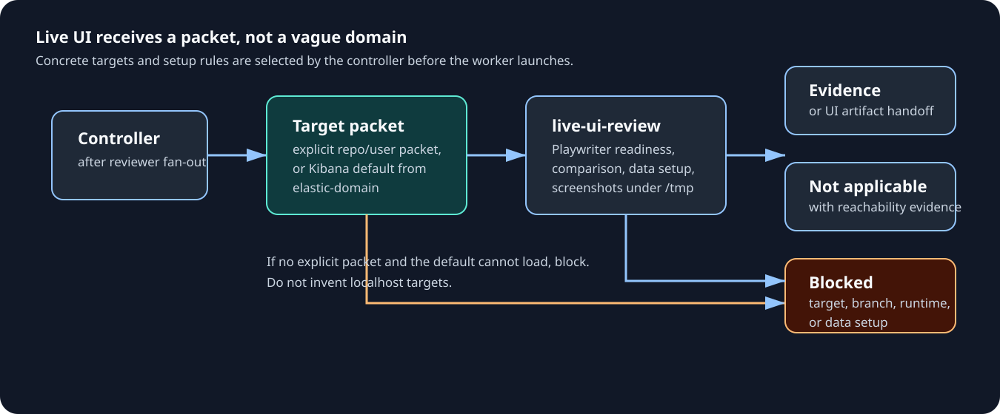

# Multi-agent topology

`/k-deep-review` is the orchestration entrypoint. Cursor, Copilot, Claude, Codex, and Antigravity bridge it through their native isolation mechanisms where available.

The flow is a phased investigation pipeline, not a loose collection of agents. The key invariant is phase ownership: workers investigate; the controller judges and performs any gated side effect.

## Mental model: phase ownership

| Phase                 | Starts only after                                                     | Owns                                                                                                  | Stops the flow when                                                                    |
| --------------------- | --------------------------------------------------------------------- | ----------------------------------------------------------------------------------------------------- | -------------------------------------------------------------------------------------- |
| Route + scope         | user invokes review flow                                              | mode, authorship, target packet, constraints, intent dependencies, context-pack packet                | authorship/scope/intent dependency cannot be resolved safely                           |
| PR necessity / intent | route says PR + other/unknown author, or local changes need PR intent | whether the PR is worth implementation review and whether intent artifacts are current                | PR is blocked, superseded, unclear, not needed, incorrectly open, or intent is unclear |
| Reviewer fan-out      | PR necessity/intent greenlight or non-applicable skip                 | read-only candidate findings and `verification_needed` from the shared context pack when used         | every launched lane finishes; individual blockers become controller input              |
| Lane merge/dedup      | every reviewer lane returned                                          | one merged candidate set and UI/runtime applicability trigger                                         | merged candidate set is empty (later phases report skipped)                            |
| Live UI               | lane merge/dedup returns and UI/runtime is relevant                   | UI reality, required screenshot handoff for feedback candidates, target/runtime/data blockers         | target packet, runtime, data, or required screenshots are blocked                      |
| Findings audit        | reviewer lanes and live UI outputs exist or are explicitly skipped    | actionability, duplication, gaps, overengineering, verification-ledger audit                          | audit finds no actionable surviving finding or reports blocker                         |
| Final adversarial     | findings audit returns audited candidates                             | per-candidate verdicts plus a bounded miss sweep, on a cross-family model when the registry pairs one | verifier cannot complete or produces unusable evidence                                 |
| Controller judgment   | all investigation phases are complete                                 | keep/drop, serial verification ledger, PR pending-review reconciliation                               | unsupported or conflicting payload would be produced                                   |
| Act                   | judgment is complete and blocking ledger items are resolved           | fixes, drafts, gated posting                                                                          | human-visible gate or quality gate blocks                                              |
| Post-act verification | the working tree was edited this flow                                 | quality gates, fix-diff four-dimension stage, carried `verification_needed`                           | setup itself fails or the toolchain is genuinely unavailable                           |

## Using it

### Route and scope

The controller first resolves the route and scope packet: PR/local mode, role, target diff/PR/thread set, base branch, user constraints, expected output, and any intent dependencies needed for judgment.

For other-authored or unknown-author PRs, `k-agent-pr-necessity-auditor` runs first and blocks fan-out until it greenlights implementation review. It also runs as an intent audit for local changes attached to an assigned/adopted PR when PR body, discussion, Slack, issues, or history are needed to judge the local diff.

PR necessity checks:

- whether the PR is sensible.
- whether it is correctly open.
- whether the work is still needed.
- whether overlapping open/recently merged work exists.
- author intent from PR, references, history, and available GitHub/Slack context.

Review greenlight is separate from merge readiness. Unknown mergeability or failing status checks are reported as status uncertainty, not as "no conflicts".

### Reviewer fan-out

After any required PR necessity greenlight, the controller builds a **bounded angle roster** from scope-level evidence: changed paths and diff stats, never code reading. It launches one to three sighted read-only reviewer lanes by default, all on the **resolved lane model** for the harness. Four or five sighted lanes are reserved for explicit maximum-rigor requests or multiple high-risk classes in the same diff.

Before that roster launches, the controller materializes a read-only context pack for PR metadata, comments, reviews, checks, diff, and changed-file/base snapshots, then includes the pack root and expected `head_sha` in every worker scope packet. Workers consume it through `context-pack.md`, verify `manifest.head_sha`, and report `pack_used`, `pack_stale`, or `pack_missing`.

`correctness-regressions` always runs. A single-surface diff with no independent risk trigger uses that one sighted lane; the adversarial verifier (cross-family preferred at equal capability, SOP §3.7) supplies the independent refutation pass after findings audit.

Which lenses exist, when each is implicated, and what each one checks live in one place: `k-review/references/lanes.md`. It defines sixteen lenses — correctness, tests, design/modularity, API contracts, security/authz, data persistence, concurrency/state, error and failure modes, performance, deletion/replacement, product flow, frontend rendering, accessibility, observability, dependency/config, and docs/contract drift — and wires the ones with a matching expert skill (`k-code-quality`, `-tests`, `-react`, `-web`, `k-codebase-design`) to load it. Availability is free; only launched lanes cost tokens.

The controller pastes the selected lane's lens skill and check list into that worker's scope packet. Workers never load `lanes.md`, so growing the catalog does not grow any lane's context.

Lenses focus attention but are not ownership boundaries. Verified out-of-angle findings return marked, never dropped. Lanes are told not to hunt outside their lens, because speculative breadth is what makes parallel lanes return the same shallow findings.

A **blind fresh-eyes clarity lane** joins the same batch only when PR-review or local-changes mode touches human-maintained code/docs and scope-level evidence shows comprehension risk: public interface/naming changes, AI-facing or user-facing prose, state-machine/replacement/deletion work, more than 500 changed lines, or more than 10 changed files. It receives only the diff scope — no PR body, commit messages, issue text, or prior findings, including on re-runs — loads none of the review methodology, and returns clarity-only findings capped at MEDIUM.

Context that explains confusing code does not refute a fresh-eyes finding. It confirms the context lives in the wrong place, and the controller uses it to pick the fix.

Reviewer lanes are investigation-only:

- they may run deep non-mutating verification.
- they do not edit the worktree.
- they do not seed data or start shared services.
- they do not run generators/formatters/installers.
- they return `verification_needed` when stronger evidence requires mutation or a shared runtime.

The controller tracks those entries in a verification ledger. A ledger item that can flip a keep/drop/action decision stays blocking until it is resolved with evidence, run serially, or reported as an explicit blocker.

Findings audit can recommend a disposition, but it cannot erase the dependency or turn an unresolved fork into "not needed" by assuming one branch.

### Live UI and evidence handoff

`k-agent-live-ui-review` starts after lane merge/dedup when UI/runtime is relevant and checks applicable candidates with Playwriter against a controller-supplied target packet. Any UI-related finding that may become review feedback needs screenshot handoff evidence, unless the worker returns a valid blocker or non-applicability result.

Live UI can return:

| Result              | Meaning                                                                                                                                                                                                |
| ------------------- | ------------------------------------------------------------------------------------------------------------------------------------------------------------------------------------------------------ |
| comparison evidence | UI/runtime finding is verified                                                                                                                                                                         |
| screenshot handoff  | required focused local screenshots under `/tmp` for UI findings that may become review feedback; the enclosing folder is opened/provided and the handoff includes md5s, dimensions, and self-QA status |
| `Not applicable`    | target does not apply to the introduced surface                                                                                                                                                        |
| blocker             | target, branch, runtime, data setup, or screenshot capture is blocked                                                                                                                                  |

For UI-facing PR findings, the controller keeps image paths out of GitHub review bodies and reports a separate `UI evidence attachments:` handoff. That handoff includes local paths, descriptions, target branch/URL, suggested comment placement, md5s, dimensions, and whether the controller viewed the image before human-visible use.

If a kept UI finding lacks screenshots without a valid blocker or non-applicability result, the controller reruns live UI or blocks instead of drafting text-only feedback.

### Findings audit

The findings audit runs after live UI and before final adversarial verification. The controller audits inline for trivial sets: zero or one straightforward finding with no disagreement, blocker, or fix diff.

For non-trivial sets, including material `verification_needed`, the controller delegates to `k-agent-findings-auditor`. It flags redundancy, verbosity, semantic + logical duplication, gaps, actionability problems, overengineered proposed fixes, and verification-ledger disposition problems.

When two or more reviewer lanes report the same root cause, the audit should merge/dedupe it into one candidate unless hard evidence proves a drop reason.

### Final adversarial verification

After findings audit, the controller runs **final adversarial verification**. One worker (cross-family preferred at equal capability, SOP §3.7) receives only the audited candidates, with lane attribution stripped, and tries to refute each claim by testing truth, reachability, severity, proposed fix, and already-covered status.

Verdicts (`confirmed`/`refuted`/`undecidable`) feed the verification ledger. A refutation becomes a hard drop reason only after the controller checks its evidence addresses the candidate's actual claim.

The verifier then runs a **bounded miss sweep**. It is usually the only model from a different family that reads the diff, and the finder lanes share a family and a prompt, so what they all missed is what it is best positioned to catch. Refutation alone discards that. The sweep is scoped to the highest-risk changed surface, holds the same evidence bar as a verdict, and returns at most three `new-candidate` items or `none above the bar`. Because they have not passed the findings audit, the controller re-audits them inline before judgment and reports produced-versus-survived counts.

On harnesses where the resolver returns the same family for both roles, the phase runs on the lane model with refutation framing and reports `families=same (degraded)` when no second family is reachable, or `families=same (reduced independence)` when `verifier_status: reduced_independence` marks a deliberate capability-first pairing (OMP) — capability outranks family diversity (SOP §3.7). Either state is reported, never silent. Cursor, Copilot, and Pi still carry counters: Cursor uses `claude-opus-5-high` against GPT-5.6 SOL lanes, Copilot uses `claude-fable-5.1` against OpenAI lanes, and Pi uses `openrouter/anthropic/claude-sonnet-4.6:xhigh` against OpenAI GPT-5.5 lanes.

The controller aggregates the investigation outputs, then judges what to fix or draft through mode-correct review rules. For each ledger item, it either resolves it with evidence, runs the check serially when needed for judgment, marks it not needed with evidence, or reports the exact blocker/uncertainty.

Drop decisions need a source/API/runtime-backed hard reason. Otherwise the controller keeps the finding, merges it with a duplicate, runs needed verification, or blocks with explicit uncertainty.

PR modes use PR dedup, PR artifact truth filtering, the PR necessity/correctly-open greenlight, and PR CI coverage gates. Local changes are judged against the staged/unstaged/range scope without PR-thread or PR-CI exemptions unless a PR-intent dependency is required for the local diff.

Before final PR-mode drafting or posting, the controller reconciles against existing review feedback already authored by the current account: API `PENDING` reviews and draft comments, plus submitted review comments/replies from previous sessions.

It merges still-valid pending feedback with net-new findings into one payload, drops stale pending findings, and blocks rather than producing conflicting or fragmented review comments. Only the controller acts. A purely additive payload is appended to the existing pending review; delete/recreate is reserved for changing or dropping existing draft comments.

## Reference: runtime wiring

### Reviewer lane mapping

| Runtime        | Worker lanes                                                                                    |
| -------------- | ----------------------------------------------------------------------------------------------- |
| Cursor/Copilot | `k-agent-review-worker` once per selected sighted angle (resolved lane model)                   |
| Claude         | `k-agent-reviewer` once per selected sighted angle through `Task` with `model: inherit`         |
| Codex          | `spawn_agent` `k-agent-review-worker` agents, one per selected sighted angle                    |
| Antigravity    | `k-agent-review-worker` once per selected sighted angle                                         |
| any (blind)    | conditional fresh-eyes via a generic read-only task (Pi/OMP: thin `k-agent-fresh-eyes` profile) |
| verify (cross) | `k-agent-adversarial-verifier` on the resolved verifier model (different family when available) |

### Model policy

Model selection is registry-driven and deterministic.

| Lane                                       | Model                                                                                                                                                                      |
| ------------------------------------------ | -------------------------------------------------------------------------------------------------------------------------------------------------------------------------- |
| angle lanes, fresh-eyes, auditors, live UI | `review-agent-model.partial` / `resolve_review_agent_model` resolves `category_models.<harness>.review`, or a sparse override such as Claude `inherit` / Antigravity `pro` |
| adversarial verifier                       | same resolver, using `category_models.<harness>.refute` plus its `verifier_status`                                                                                         |
| verifier on same-family harnesses          | `verifier_status: reduced_independence` reports deliberate same-family policy; default fallback reports `families=same (degraded)`                                         |

Every repo-owned review profile's `model` frontmatter is a chezmoi template over `review-agent-model.partial`, which derives from `agent_bindings`, `agent_categories`, `category_models`, and sparse `review_model_overrides`. Updating a derivable model is a one-line category row edit, and neither skills nor controllers steer models at runtime; generic fresh-eyes is the only runtime pass-through, used only where no named fresh-eyes profile exists.

The review's diversity comes from angles plus the adversarial verify pass (cross-family preferred at equal capability, SOP §3.7); the registry keeps the family pairing a human decision instead of a launch-time inference.

### Live UI target selection

| Case                                           | Behavior                                            |
| ---------------------------------------------- | --------------------------------------------------- |
| explicit user/repo target packet exists        | use it                                              |
| no explicit target and verified Kibana applies | use `k-elastic-domain/references/kibana-live-ui.md` |
| no target packet can be loaded                 | block instead of inventing targets                  |

For verified `elastic/kibana` targets, `k-elastic-domain` supplies Kibana targets, mapped Elasticsearch endpoints, Dev Tools Console fallback, and runtime-blocker rules. Generic review contracts do not inline those targets.

`k-agent-live-ui-review` and `k-ui-capture`'s proof-mode contract verify the local browser only; there is no automatic or context-inferred Windows/VirtualBox path in this flow. Windows/VirtualBox coverage is the separate manual [`k-live-ui-windows`](../../../../home/exact_dot_agents/exact_skills/exact_k-live-ui-windows/) skill: load it by hand only when the user explicitly asks for Windows/VirtualBox verification this turn, never from PR/issue/spec inference.

When `k-live-ui-windows` is used against a Kibana target, `k-elastic-domain` rewrites `kbn_url`/`es_url` to the guest-reachable NAT gateway address and folds `server.host=0.0.0.0` into the required Kibana flags. The manual skill owns only the CDP connection mechanics, never Kibana-specific hostnames or flags.

## Internals (for maintainers)

Controller responsibilities:

- route and scope.
- materialize a read-only context pack and pass its path plus expected `head_sha` in worker packets.
- run PR necessity gate when required.
- fan out after greenlight.
- run live UI after lane merge/dedup when UI/runtime is relevant.
- audit findings inline or by delegation, then run final adversarial verification, then re-audit the verifier's miss-sweep candidates inline.
- run repo-wide suites and full builds once, before the lane batch, and pass the result into every scope packet; lanes are told not to repeat shared work.
- report lane yield (candidates returned versus findings kept) so an unproductive trigger can be pruned from later runs.
- aggregate, filter, and reconcile pending-review context.
- act after normal gates: apply fixes when `fix_authorized: yes` (own, assigned, adopted PR, or local-changes self flow), otherwise draft only.
- run post-act verification whenever the working tree was edited: quality gates plus the fix-diff four-dimension stage.
- restart from the earliest invalidated phase when the user supplies new context that changes target, intent, or accepted behavior; if leaving `/k-deep-review`, state that downgrade before editing.
- block completion while decisive verification-ledger items, intent dependencies, pending-review reconciliation blockers, required live-UI triggers without valid blockers, or post-act verification items remain unresolved.

Worker profiles are read-only, concurrency-safe, and recursion-safe. They load review methodology in isolated contexts and return candidate findings plus `verification_needed`.

Each delegated phase emits a `Worker selection:` line before launch with the phase, profile, task agent type, model, named/fallback invocation, and fallback reason. This keeps markdown session exports auditable even when the runtime hides raw task arguments.

When a phase needs a follow-up turn in an existing worker, the controller sends the follow-up and waits for the completion notification instead of repeatedly polling with long `read_agent` waits. The phase remains blocking, but the controller does not burn time on status checks. Delivery acknowledgement is not progress; request-too-large failures and empty turns mark the worker dead, so the controller respawns a fresh worker or takes over inline. Follow-ups are capped, and worker-reported numbers are self-reports until checked against independent evidence.
