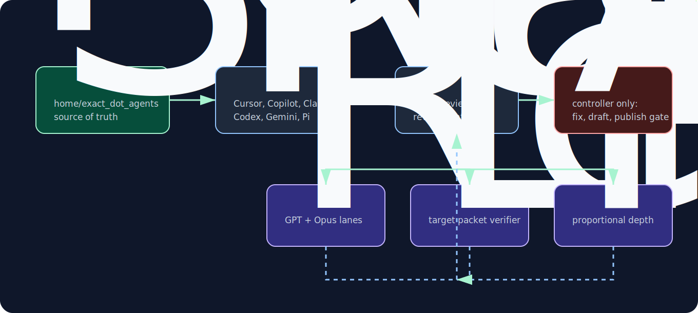

# Cross-harness subagents

Subagents run a self-contained task in an isolated child context window and return only a digest. That keeps heavy reads, searches, and review fan-out from bloating the parent conversation.

## Two portable layers

| Layer                        | Portable? | Role                                                                     |
| ---------------------------- | --------- | ------------------------------------------------------------------------ |
| Skills (`~/.agents/skills/`) | Yes       | Cross-harness source of truth for methodology and routing                |
| Subagents                    | No        | Runtime-specific wrappers that load a skill in an isolated child context |

Every custom subagent profile is a chezmoi template that renders the shared tmux `prefix.txt` preamble before role instructions, so child contexts start with the same verification discipline as parent sessions.

The role body itself is single-sourced. Each per-tool profile is a thin shim: per-tool frontmatter (model, tools, sandbox) + the `prefix.txt` preamble + `Load and follow ~/.agents/skills/agent-review/references/<role>.md`. The delegated-subagent contract for every role (`reviewer-worker`, `pr-necessity-auditor`, `findings-auditor`, `live-ui-review`, `post-review`, `change-auditor`, `researcher`, `code-searcher`) lives once under `agent-review/references/`, which in turn loads the owning skill (`review`, `light-review`, `research`, `semantic-code-search`). Only genuinely harness-specific notes (e.g. "Claude subagents cannot spawn subagents") stay inline. Cursor and Copilot are the canonical shim shape; the other harnesses follow it.

## Runtime discovery

| Harness            | Subagent/profile source                                                                                      |
| ------------------ | ------------------------------------------------------------------------------------------------------------ |
| Cursor CLI         | project `.cursor/agents/` and user `~/.cursor/agents/`; project agents have higher priority                  |
| GitHub Copilot CLI | `~/.copilot/agents/*.agent.md` and project `.github/agents/*.agent.md`; configured with `subagents.agents.*` |
| Claude Code        | `~/.claude/agents/*.md`; launched via `Task` with `subagent_type`                                            |
| Codex CLI          | `$CODEX_HOME/agents/*.toml`; launched through `multi_agent` `spawn_agent`/`wait`                             |
| Gemini CLI         | project `.gemini/agents/*.md` and user `~/.gemini/agents/*.md`; exposed as tools and forced with `@name`     |
| Pi                 | `~/.pi/agent/agents/*.md`; built-in subagents disabled to avoid name collisions                              |

Verified discovery anchors:

| Harness     | Verified surface                                                                                                          |
| ----------- | ------------------------------------------------------------------------------------------------------------------------- |
| Cursor CLI  | bundled `~/.cursor/skills-cursor/create-subagent/SKILL.md`; `cursor-agent 2026.06.15-18-00-12-6f5a2cf`                    |
| Copilot CLI | `copilot --agent <name>`, `/agent`, and `copilot help config`; version `copilot 1.0.63`                                   |
| Claude Code | `claude --agent`, `--agents`, `claude agents`, and `Task.subagent_type`; version `claude 2.1.179`                         |
| Codex CLI   | `$CODEX_HOME/agents/*.toml` plus `multi_agent.spawn_agent` / `wait`; source `openai/codex@45f603302c45`                   |
| Gemini CLI  | `.gemini/agents/*.md`, `@name` forcing, and no subagent-to-subagent calls; source `google-gemini/gemini-cli@f741d0328209` |

Model identifiers are not portable. Cursor review lanes use `gpt-5.5-extra-high` and `claude-opus-4-8-xhigh`; Copilot uses `gpt-5.5` and `claude-opus-4.8` with `effortLevel: xhigh`; Pi encodes reasoning effort in model slug suffixes such as `:xhigh`.

Runtime probes confirmed project custom-agent invocation in Cursor and Copilot, Copilot task subagents with explicit model overrides, both Opus IDs, and Codex `spawn_agent` / `wait`. Cursor source supports custom subagent types, but the model-facing Task schema can expose only generic types in some runs; `/agent-review` must prefer named Cursor profiles when exposed and use generic exact-model fallback only when the active schema hides them.

## Agent suite

The "Loads contract" column is the `agent-review/references/<role>.md` file the profile delegates to; that contract loads the owning skill in turn.

| Agent                                       | Loads contract         | Work it owns                                                       |
| ------------------------------------------- | ---------------------- | ------------------------------------------------------------------ |
| `agent-review`                              | `agent-review/SKILL`   | Controller: route, PR-necessity gate, fan-out, live UI, audit, act |
| `review-controller` (Pi)                    | `review/SKILL`         | Pi controller for PR gates, reviews, audits, fixes/drafts/verdict  |
| `review-gpt-5-5-extra-high`                 | `reviewer-worker`      | Read-only GPT reviewer lane                                        |
| `review-opus-4-8-xhigh-non-thinking`        | `reviewer-worker`      | Read-only Opus reviewer lane                                       |
| `reviewer`                                  | `reviewer-worker`      | Pi/Claude read-only review worker                                  |
| `review-worker`                             | `reviewer-worker`      | Codex read-only review worker role                                 |
| `review-gemini-pro` / `review-gemini-flash` | `reviewer-worker`      | Gemini reviewer lanes                                              |
| `pr-necessity-auditor`                      | `pr-necessity-auditor` | Blocking PR necessity / intent gate                                |
| `findings-auditor`                          | `findings-auditor`     | Non-trivial findings or named fix-diff audit                       |
| `live-ui-review`                            | `live-ui-review`       | Verification-only live UI reviewer with screenshot handoff         |
| `post-review`                               | `post-review`          | Four-dimension hygiene audit of a review's fix diff                |
| `change-auditor`                            | `change-auditor`       | Proportional-depth audit of a self-authored changeset              |
| `researcher`                                | `researcher`           | Clone and inspect external GitHub source                           |
| `code-searcher`                             | `code-searcher`        | SCSI semantic investigation / base-branch context                  |

## Review hierarchy

The review topology follows the `review` skill's role × mode matrix:

1. **PR necessity / intent gate** runs first and blocks implementation review for other-authored or unknown-author PRs until the PR is worth reviewing. It also runs for local changes attached to an adopted/assigned PR when PR intent artifacts are needed to judge the diff.
2. **Find/judge fan-out** runs read-only reviewer lanes in parallel after any required greenlight.
3. **Live UI** runs only when UI/runtime verification is relevant and a target packet exists.
4. **Findings audit** is inline for trivial sets and delegated for non-trivial findings, disagreements, material `verification_needed`, blockers, or overengineering risk. It audits verification-ledger disposition; it does not erase unresolved dependencies.
5. **Act** is serial and controller-owned: fix, draft, drain threads, or emit verdict only after blocking verification-ledger items and intent dependencies are resolved or surfaced as blockers.

Workers never edit files, post comments, resolve threads, or decide final action. They return candidate findings plus evidence and `verification_needed` items for the controller ledger.

## Source paths

| Target                         | Source                                                                                      | Consumed by |
| ------------------------------ | ------------------------------------------------------------------------------------------- | ----------- |
| `~/.cursor/agents/*.md`        | [`home/dot_cursor/exact_agents/`](../../../home/dot_cursor/exact_agents/)                   | Cursor      |
| `~/.copilot/agents/*.agent.md` | [`home/private_dot_copilot/exact_agents/`](../../../home/private_dot_copilot/exact_agents/) | Copilot     |
| `~/.claude/agents/*.md`        | [`home/dot_claude/exact_agents/`](../../../home/dot_claude/exact_agents/)                   | Claude      |
| `~/.codex/agents/*.toml`       | [`home/dot_codex/exact_agents/`](../../../home/dot_codex/exact_agents/)                     | Codex       |
| `~/.gemini/agents/*.md`        | [`home/dot_gemini/exact_agents/`](../../../home/dot_gemini/exact_agents/)                   | Gemini      |
| `~/.pi/agent/agents/*.md`      | [`home/dot_pi/agent/exact_agents/`](../../../home/dot_pi/agent/exact_agents/)               | Pi          |

## Design notes

- Profile bodies start with `prefix.txt`, then instruct the child to load the wrapped skill or runtime contract.
- Cursor/Copilot `agent-review` profiles load only the `/agent-review` skill; reviewer/auditor/live profiles load the runtime contracts, and reviewer workers load shared `review` methodology inside child contexts.
- Cursor profiles are real runtime shims, not dead files: Cursor loads `.cursor/agents`, and its internal Task protocol has a custom subagent-name field. Whether the controller can address those profiles depends on the active model-facing Task schema.
- Profiles stay generic. Domain-specific targets or rules are selected by the controller from a verified domain overlay and passed to workers as concrete packets.
- Hard runtime read-only flags are not the review safety boundary. Review/audit profile shims keep shell-capable permissions so workers can run safe verification commands; the shared role contracts enforce behavior-level read-only/no-mutation.
- Copilot internal worker profiles are hidden from `/agent` but remain model-invocable so the controller can launch named task agents.
- Pi disables its built-in subagents because stock names overlap with custom roles. Pi also recursively exposes skills as subagents; that leakage is cosmetic and accepted because our agent names are distinct.

## Related

- [Review workflow](reviews/index.md)
- [Tool configs](tool-configs/index.md)
- [Ralph orchestrator](ralph/index.md)
