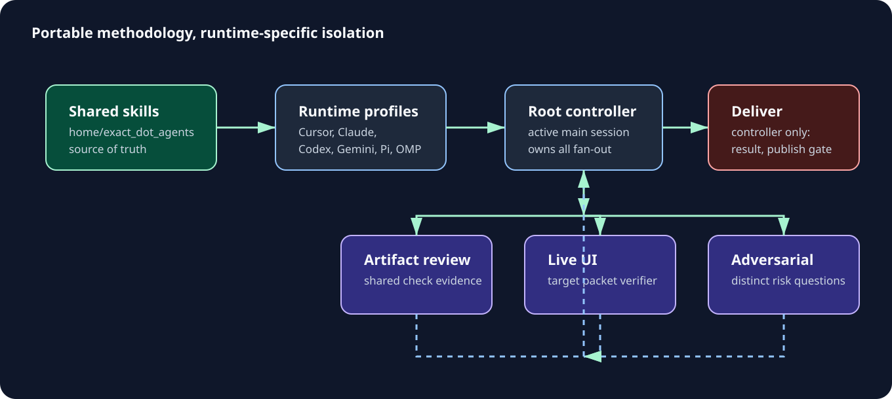

# Cross-harness subagents

Subagents run a self-contained task in an isolated child context window and return only a digest. That keeps heavy reads, searches, and review fan-out from bloating the parent conversation.

## Mental model

There are two portable layers:

| Layer                        | Portable? | Role                                                                     |
| ---------------------------- | --------- | ------------------------------------------------------------------------ |
| Skills (`~/.agents/skills/`) | Yes       | Cross-harness source of truth for methodology and routing                |
| Subagents                    | No        | Runtime-specific wrappers that load a skill in an isolated child context |

Every custom subagent profile is a chezmoi template that renders the shared tmux `prefix.txt` preamble before role instructions. Child contexts therefore start with the same verification discipline as parent sessions.

Only the active root/main session orchestrates multiple agents or lanes. Delegated children are always leaf workers: they complete the assigned packet, perform its normal verification, and return evidence or a blocker to the parent without launching descendants or inventing extra lanes inline.

Repo-owned custom subagent identifiers use the `k-agent-<role>` namespace. Harness-native identifiers retain their original names; the repo must not prefix or alias them.

The role body itself is single-sourced. Each per-tool profile is a thin shim: harness-native model, tool/permission, and sandbox metadata + the `prefix.txt` preamble + `Load and follow ~/.agents/skills/k-review/references/<role>.md`.

## Using it

Runtime discovery is harness-specific:

| Harness            | Subagent/profile source                                                                                                                                                                                                                                                                                                                                                                                                                                                                                                                                                        |
| ------------------ | ------------------------------------------------------------------------------------------------------------------------------------------------------------------------------------------------------------------------------------------------------------------------------------------------------------------------------------------------------------------------------------------------------------------------------------------------------------------------------------------------------------------------------------------------------------------------------ |
| Cursor CLI         | project `.cursor/agents/` only — a workspace profile extends the Task `subagent_type` enum, but user `~/.cursor/agents/` is never scanned (probed 2026-08-30, cursor-agent 2026.08.28-a7f9513: fresh session rejected the deployed user-level `k-agent-smol` while a project-level `k-agent-smol` spawned). Upstream docs promise user-level discovery ([cursor.com/docs/subagents](https://cursor.com/docs/subagents): "User subagents \| `~/.cursor/agents/` \| All projects for current user"), so this is a cursor-agent bug; the profiles stay deployed for when it lands |
| GitHub Copilot CLI | `~/.copilot/agents/*.agent.md` and project `.github/agents/*.agent.md`; configured with `subagents.agents.*`                                                                                                                                                                                                                                                                                                                                                                                                                                                                   |
| Claude Code        | `~/.claude/agents/*.md`; launched via `Task` with `subagent_type`                                                                                                                                                                                                                                                                                                                                                                                                                                                                                                              |
| Codex CLI          | `$CODEX_HOME/agents/*.toml`; launched through `multi_agent` `spawn_agent`/`wait`                                                                                                                                                                                                                                                                                                                                                                                                                                                                                               |
| Antigravity        | Runtime-defined subagents via `define_subagent` / `invoke_subagent`; skills dynamically loaded                                                                                                                                                                                                                                                                                                                                                                                                                                                                                 |
| Pi                 | `~/.pi/agent/agents/*.md`; built-in subagents disabled to avoid name collisions                                                                                                                                                                                                                                                                                                                                                                                                                                                                                                |

Verified discovery anchors:

| Harness     | Verified surface                                                                                        |
| ----------- | ------------------------------------------------------------------------------------------------------- |
| Cursor CLI  | bundled `~/.cursor/skills-cursor/create-subagent/SKILL.md`; `cursor-agent 2026.06.15-18-00-12-6f5a2cf`  |
| Copilot CLI | `copilot --agent <name>`, `/agent`, and `copilot help config`; version `copilot 1.0.63`                 |
| Claude Code | `claude --agent`, `--agents`, `claude agents`, and `Task.subagent_type`; version `claude 2.1.260`       |
| Codex CLI   | `$CODEX_HOME/agents/*.toml` plus `multi_agent.spawn_agent` / `wait`; source `openai/codex@45f603302c45` |
| Antigravity | `~/.gemini/config/skills` symlink + progressive skill disclosure; dynamic subagent protocol             |

Profile `model` frontmatter for review roles renders through `review-agent-model.partial`, which resolves the agent category to the per-harness max/counter band and uses `review_model_overrides` only for true harness exceptions. Non-review profiles render through `agent-model.partial`, and a shared pre-tool-use gate re-applies that band to delegation calls no profile can reach — see [Model tiering](model-tiering.md).

Antigravity is the runtime-defined exception: it has no repo-owned profile files. The main session defines each review role from the shared role contract and invokes it with the `pro` tier recorded in `review_model_overrides.gemini`.

Pi encodes reasoning effort in model slug suffixes such as `:xhigh` on its per-task registry value.

Runtime probes confirmed project custom-agent invocation in Cursor and Copilot, Copilot task subagents with explicit model overrides, and Codex `spawn_agent` / `wait`.

Cursor source supports custom subagent types, but the model-facing Task schema can expose only generic types in some runs. Generic or fallback launches pass the registry value as a profile-equivalent model when the role has no usable profile frontmatter, and the adversarial verifier passes the explicitly resolved verifier id.

## Agent suite

The delegated-subagent contract for every role lives once under `k-review/references/`, except where noted below. That contract loads the owning skill (`k-review`, `k-light-review`, `k-research`, `k-semantic-code-search`) in turn.

`k-agent-fresh-eyes` is the blind clarity lane: it deliberately loads no skill. Pi and OMP carry thin `k-agent-fresh-eyes` profiles resolved by `review-agent-model.partial`; other harnesses launch it through a generic task carrying the same contract and resolved model value.

The "Loads contract" column is the `k-review/references/<role>.md` file the profile delegates to:

| Agent                                                    | Loads contract                           | Work it owns                                                                            |
| -------------------------------------------------------- | ---------------------------------------- | --------------------------------------------------------------------------------------- |
| `k-agent-deep-review`                                    | `k-deep-review/SKILL`                    | Controller: route, PR-necessity gate, bounded reviewer roster, live UI, audit, act      |
| `k-agent-review-controller` (Pi/OMP)                     | `k-deep-review/SKILL` + `k-review/SKILL` | Pi/OMP controller for PR gates, reviews, audits, fixes/drafts/verdict                   |
| `k-agent-review-worker`                                  | `reviewer-worker`                        | Registry-model selected angle lane (Cursor/Copilot/Codex/Antigravity)                   |
| `k-agent-reviewer`                                       | `reviewer-worker`                        | Pi/OMP concrete registry lane; Claude inherited read-only angle lane                    |
| `k-agent-fresh-eyes` (Pi/OMP profile; generic elsewhere) | `fresh-eyes`                             | Conditional blind zero-context clarity lane                                             |
| `k-agent-adversarial-verifier`                           | `adversarial-verifier`                   | Cross-family refutation over audited candidates                                         |
| `k-agent-pr-necessity-auditor`                           | `pr-necessity-auditor`                   | Blocking PR necessity / intent gate                                                     |
| `k-agent-findings-auditor`                               | `findings-auditor`                       | Non-trivial findings or named fix-diff audit                                            |
| `k-agent-live-ui-review`                                 | `live-ui-review`                         | Verification-only live UI reviewer; screenshot handoff required for feedback candidates |
| `k-agent-post-review`                                    | `post-review`                            | Four-dimension hygiene audit of a review's fix diff                                     |
| `k-agent-criteria-verifier`                              | `k-build/references/criteria-verifier`   | `/k-build` refutation lane over the criteria ledger + scope audit                       |
| `k-agent-change-auditor`                                 | `change-auditor`                         | Proportional-depth audit of a self-authored changeset                                   |
| `k-agent-researcher`                                     | `researcher`                             | Clone and inspect external GitHub source                                                |
| `k-agent-code-searcher`                                  | `code-searcher`                          | SCSI semantic investigation / base-branch context                                       |

## Reference and wiring

Source paths:

| Target                         | Source                                                                                          | Consumed by |
| ------------------------------ | ----------------------------------------------------------------------------------------------- | ----------- |
| `~/.cursor/agents/*.md`        | [`home/dot_cursor/exact_agents/`](../../../home/dot_cursor/exact_agents/)                       | Cursor      |
| `~/.copilot/agents/*.agent.md` | [`home/private_dot_copilot/exact_agents/`](../../../home/private_dot_copilot/exact_agents/)     | Copilot     |
| `~/.claude/agents/*.md`        | [`home/dot_claude/exact_agents/`](../../../home/dot_claude/exact_agents/)                       | Claude      |
| `~/.codex/agents/*.toml`       | [`home/dot_codex/exact_agents/`](../../../home/dot_codex/exact_agents/)                         | Codex       |
| `~/.pi/agent/agents/*.md`      | [`home/dot_pi/agent/exact_agents/`](../../../home/dot_pi/agent/exact_agents/)                   | Pi          |
| `~/.omp/agent/agents/*.md`     | [`home/dot_omp/private_agent/exact_agents/`](../../../home/dot_omp/private_agent/exact_agents/) | OMP         |

Not every harness ships every profile:

- Cursor, Copilot, Claude, Pi, and OMP carry a controller profile (`k-agent-deep-review` or `k-agent-review-controller` by harness convention).
- Codex ships only worker/verifier/auditor lanes, so the controller role stays in the interactive session.

The `/k-build` flow's `k-agent-criteria-verifier` uses the contract under `k-build/references/criteria-verifier.md` and the same review-model resolver as `k-agent-adversarial-verifier`. Profile-based harnesses render it normally; Antigravity defines it dynamically and invokes its `pro` tier.

Claude carries no profile for `k-agent-criteria-verifier`. This follows the same convention as `k-agent-adversarial-verifier`: the lane runs degraded on the session model there.

## Review hierarchy

The phase order these profiles serve — necessity gate → bounded reviewer roster → live UI when applicable → findings audit → final adversarial verification → controller act — is owned by [Deep-review topology](reviews/deep-review-topology.md). This page only maps profiles to harnesses.

A controller profile may orchestrate only when it is running as the active root/main session. If another agent delegates to that profile as a child, the leaf-worker boundary wins: the child ignores the orchestration request, completes any remaining leaf-scoped work, and returns the result plus the conflict instead of spawning or simulating downstream lanes.

Workers never edit files, post comments, resolve threads, or decide final action. They return candidate findings plus evidence and `verification_needed` items for the controller ledger.

## Design notes

- Profile bodies start with `prefix.txt`, then instruct the child to load the wrapped skill or runtime contract.
- Cursor/Copilot `k-deep-review` profiles load only the `/k-deep-review` skill.
- Reviewer/auditor/live profiles load the runtime contracts, and reviewer workers load shared `k-review` methodology inside child contexts.
- Cursor loads project-level `.cursor/agents` (the Task protocol has a custom subagent-name field), but never user-level `~/.cursor/agents` — the deployed user-level profiles are unreachable at runtime. They stay deployed deliberately (user call 2026-08-30): upstream documents user-level discovery, so the gap is a cursor-agent bug, and the profiles activate the moment it is fixed. Until then, Cursor `k-agent-smol`/review delegation rides the generic-spawn fallback and the band gate.
- Whether the controller can address those profiles depends on the active model-facing Task schema.
- Profiles stay generic. Domain-specific targets or rules are selected by the controller from a verified domain overlay and passed to workers as concrete packets.
- Hard runtime read-only flags are not the review safety boundary. Review/audit profile shims keep shell-capable permissions so workers can run safe verification commands; the shared role contracts enforce behavior-level read-only/no-mutation.
- Copilot internal worker profiles are hidden from `/agent` but remain model-invocable so the controller can launch named task agents.
- Pi disables its built-in subagents because stock names overlap with custom roles.
- Pi also recursively exposes skills as subagents; that leakage is cosmetic and accepted because our agent names are distinct.
- Only genuinely harness-specific notes, such as "Claude subagents cannot spawn subagents", stay inline.
- Cursor and Copilot are the canonical shim shape; the other harnesses follow it.

## Related

- [Review workflow](reviews/index.md)
- [Tool configs](tool-configs/index.md)
