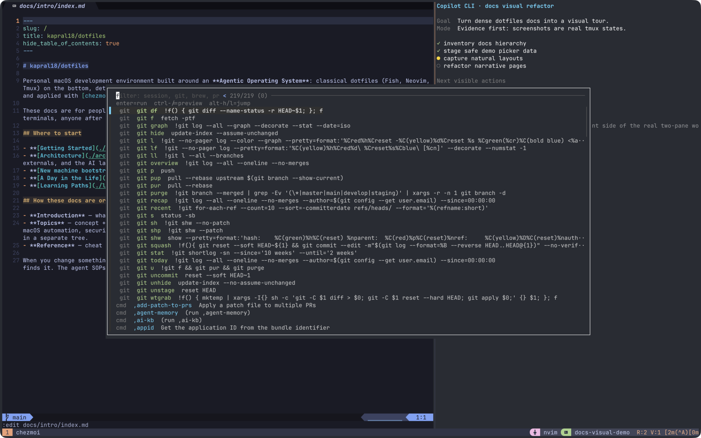

# Custom Commands

This setup ships small, purpose-built commands into `~/bin`. Anything named `home/exact_bin/executable_,name` becomes a command called `,name`.



## How to discover them

```bash
ls -1 "$HOME/bin" | rg '^,'
command -v ,w
,w --help
```

The fastest visual entry point is the tmux command palette: `prefix` + `r`. It indexes comma commands, tmux bindings, git aliases, and optional drop-in entries.

## Command families

| Family               | Use it for                                                                                 | Details                                                                                 |
| -------------------- | ------------------------------------------------------------------------------------------ | --------------------------------------------------------------------------------------- |
| Health and readiness | `,doctor`, `,kbn-pr-audit`                                                                 | [High-leverage commands](./high-leverage.md)                                            |
| Worktrees and GitHub | `,w`, `,gh-worktree`, `,gh-prw`, `,gh-issuew`, `,gh-tfork`                                 | [High-leverage commands](./high-leverage.md), [Worktrees](../git-identity/worktrees.md) |
| Patch/file transfer  | `,wh`, `,add-patch-to-prs`                                                                 | [High-leverage commands](./high-leverage.md)                                            |
| tmux helpers         | `,tmux-run-all`, `,tmux-lowfi`                                                             | [High-leverage commands](./high-leverage.md), [Tmux](../tmux/index.md)                  |
| Search and discovery | `,grepo`, `,fuzzy-brew-search`, `,search-gh-topic`, `,youtube-search`                      | [Command catalog](./catalog.md)                                                         |
| Testing and analysis | `,jest-test-title-report`, `,get-risky-tests`, `,get-age-buckets`, `,generate-git-sandbox` | [Command catalog](./catalog.md)                                                         |
| AI and agents        | `,agent-memory`, `,artifact`, `,ai-kb`, `,ralph`, provider wrappers                        | [Command catalog](./catalog.md), [AI assistants](../../ai-assistants/index.md)          |
| Utility / plumbing   | `,bat-preview`, `,fzf-*`, `,history-sync`, media helpers                                   | [Command catalog](./catalog.md)                                                         |

## Source and coverage contract

| Surface                | Source                                                                               |
| ---------------------- | ------------------------------------------------------------------------------------ |
| Commands               | [`home/exact_bin/`](../../../../home/exact_bin/)                                     |
| Fish completions       | [`home/dot_config/fish/completions/`](../../../../home/dot_config/fish/completions/) |
| Complex `,w` internals | [`home/exact_bin/utils/,w/`](../../../../home/exact_bin/utils/,w/)                   |
| Catalog diagram        | [`.mermaids/07c-bin-commands.mmd`](../../../../.mermaids/07c-bin-commands.mmd)       |
| Surface verifier       | [`scripts/verify_bin_surface.py`](../../../../scripts/verify_bin_surface.py)         |

New `~/bin` commands must have a Fish completion, docs coverage, and `.mermaids/07c-bin-commands.mmd` coverage. `make verify-bin-surface` checks that contract.

## Related

- [High-leverage commands](./high-leverage.md)
- [Command catalog](./catalog.md)
- [Worktree workflow](../git-identity/worktrees.md)
- [Ralph orchestrator](../../ai-assistants/ralph/index.md)
- [Reference map](../../../reference/reference-map.md)
