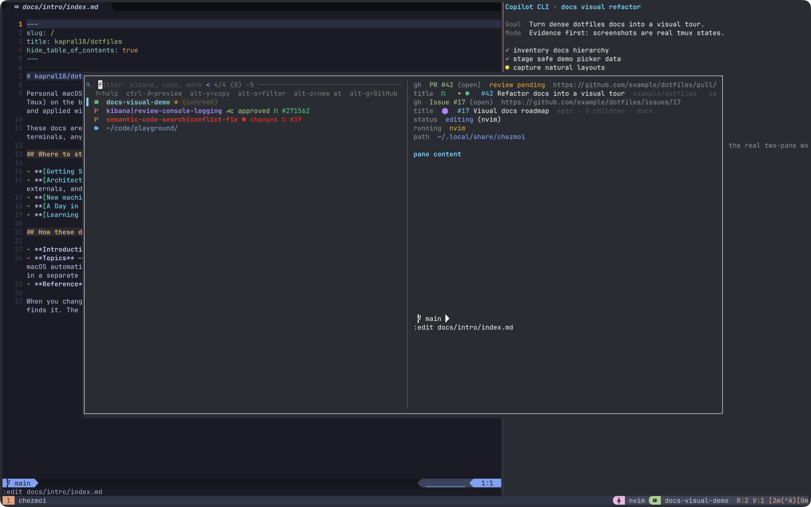

# Tmux: session picker

The session picker is the daily navigation surface for tmux sessions, git worktrees, and recent directories. It runs in a tmux popup and opens with `prefix` + `T`.

Press `alt-g` to switch to the [GitHub picker](github-picker.md) without leaving the popup loop.

## Reading the screen

| Area     | Meaning                                                                               |
| -------- | ------------------------------------------------------------------------------------- |
| Row list | Live sessions, discovered worktrees, and directory shortcuts                          |
| Badges   | Dirty state, stale/gone state, linked PR/issue, review status, and CI                 |
| Preview  | Last pane output for sessions; git status/commits for worktrees; `ls` for directories |
| Query    | Fuzzy filter; path-like queries turn fzf sorting on for better path ranking           |

The screenshot uses safe demo rows so the colors and states are visible without exposing private repository data. The UI itself is the real picker launched with `prefix` + `T`.

## Entry types

| Kind     | What it represents                            | On `enter`                               |
| -------- | --------------------------------------------- | ---------------------------------------- |
| session  | Existing tmux session                         | Switch to it                             |
| worktree | Git worktree discovered on disk               | Create/focus the canonical tmux session  |
| dir      | Directory from scan roots, zoxide, or `$HOME` | Create/focus a tmux session at that path |

Rows are de-duplicated by path with priority `session > worktree > dir`.

## Important bindings

| Key               | Action                                         |
| ----------------- | ---------------------------------------------- |
| `enter`           | Switch to or create/focus the selected session |
| `tab`             | Mark/unmark row for batch actions              |
| `ctrl-x`          | Kill selected sessions with optimistic hide    |
| `alt-x`           | Remove selected worktrees with optimistic hide |
| `ctrl-s`          | Enter send-command mode for selected rows      |
| `alt-c`           | Create a worktree off the selected repo        |
| `alt-o`           | Cycle all → dirty → review-needed → all        |
| `ctrl-r`          | Quick refresh plus background full refresh     |
| `alt-r`           | Force full refresh                             |
| `alt-p` / `alt-i` | Open linked PR / issue in the browser          |
| `alt-g`           | Switch to GitHub picker                        |
| `ctrl-/`          | Toggle preview                                 |
| `?`               | Show keybinding help in the preview            |

The GitHub picker reuses many keys but rebinds `alt-r` to quote-reply. See [GitHub picker bindings](github-picker.md#important-bindings).

## Badges

| Badge                                  | Meaning                                                |
| -------------------------------------- | ------------------------------------------------------ |
| `∗`                                    | Dirty tracked changes                                  |
| `⚠ stale`                              | Worktree directory exists but gitdir target is missing |
| `✗ gone`                               | Path no longer exists on disk                          |
| PR / issue icons                       | Branch has linked GitHub context                       |
| approved / changes requested / pending | PR review state                                        |
| green/red/yellow CI dot                | Success, failure, or pending CI                        |

Session entries inherit the state of their backing worktree.

## Preview behavior

| Selected row       | Preview shows                                                                                       |
| ------------------ | --------------------------------------------------------------------------------------------------- |
| Session            | Activity classification, running command, session path, window count, and last non-blank pane lines |
| Worktree / git dir | Path, branch, ahead/behind, status changes, and recent commits                                      |
| Stale worktree     | Diagnostic plus directory contents                                                                  |
| Non-git dir        | Directory listing                                                                                   |

Activity is classified coarsely: agent panes, idle shells, editors, or busy commands.

## Detailed mechanics

The implementation details live in [Session picker mechanics](session-picker-mechanics.md):

- send-command dispatch and selection snapshotting.
- popup geometry, scan roots, appearance, cache, and live-refresh options.
- frecency, path-aware sorting, view filters, and worktree creation.
- refresh/cursor behavior, cache files, worktree discovery, session naming, and stale-worktree safety.

## Related

- [Pickers overview + URL picker](pickers.md)
- [Session picker mechanics](session-picker-mechanics.md)
- [GitHub picker](github-picker.md)
- [Worktrees](../git-identity/worktrees.md)
